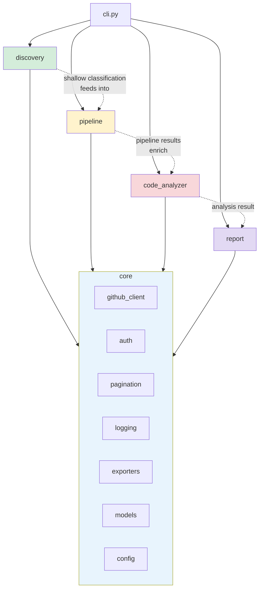
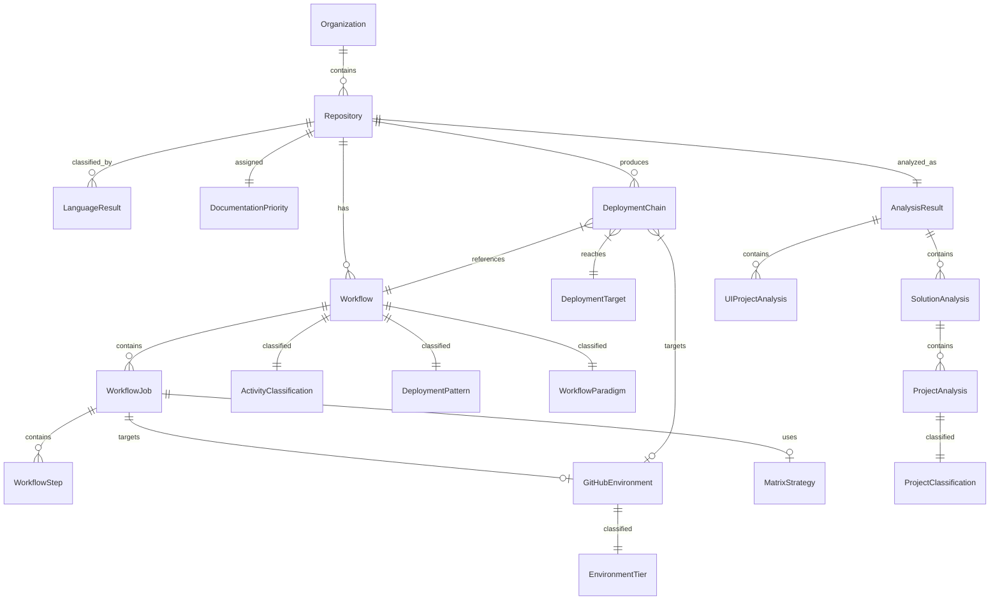

# SNK Code Analysis Framework — Python Edition

## Functional Specification & Architecture

> **Purpose**: Unified Python framework that consolidates three PowerShell analyzer projects into a single modular tool targeting GitHub public repositories.
>
> **Date**: 2026-03-18 | **Version**: 1.0 | **Status**: Draft
>
> **Predecessor**: [code-analysis-framework.md](code-analysis-framework.md) (PowerShell analysis of the 3 source projects)

---

## Table of Contents

1. [Vision & Goals](#1-vision--goals)
2. [Scope & Feature Map](#2-scope--feature-map)
3. [Architecture Overview](#3-architecture-overview)
4. [Module 1 — Core Infrastructure](#4-module-1--core-infrastructure)
5. [Module 2 — GitHub Discovery (Org/User/Topic)](#5-module-2--github-discovery)
6. [Module 3 — Pipeline Analyzer (GitHub Actions)](#6-module-3--pipeline-analyzer)
7. [Module 4 — Code Analyzer (Local Repo Deep Analysis)](#7-module-4--code-analyzer)
8. [Module 5 — Report Generator](#8-module-5--report-generator)
9. [Classification Algorithm Specification](#9-classification-algorithm-specification)
10. [Data Model](#10-data-model)
11. [CLI Interface](#11-cli-interface)
12. [Configuration](#12-configuration)
13. [Testing Strategy](#13-testing-strategy)
14. [Technology Stack & Dependencies](#14-technology-stack--dependencies)
15. [Migration Mapping (PowerShell → Python)](#15-migration-mapping)
16. [Acceptance Criteria](#16-acceptance-criteria)
17. [Appendix — GitHub API Reference](#17-appendix--github-api-reference)

---

## 1. Vision & Goals

### 1.1 Vision

A single Python CLI tool (`snk-analyzer`) that can:
1. **Discover** all repositories across a GitHub organization, user, or topic — classifying each by language, framework, deployment patterns, and documentation priority
2. **Analyze CI/CD pipelines** (GitHub Actions workflows) for a single repository — identifying deployment patterns, workflow paradigms, environment tiers, and building deployment chain relationships
3. **Deep-analyze local code** from any cloned repository — extracting architecture patterns, API endpoints, data access layers, security configurations, and generating Arc42 documentation with Mermaid diagrams

### 1.2 Goals

| Goal | Description |
|------|-------------|
| **G-01** | Preserve ALL classification algorithms from the 3 PowerShell projects with identical decision logic |
| **G-02** | Replace ADO-specific APIs with GitHub REST/GraphQL API equivalents |
| **G-03** | Support GitHub public repositories (PAT optional for rate limits, required for private repos) |
| **G-04** | Produce identical output formats: JSON, CSV, Markdown (Arc42), Mermaid diagrams |
| **G-05** | Modular Python package architecture enabling individual module use |
| **G-06** | Deterministic outputs (same input → byte-identical output) |
| **G-07** | Cross-platform (Windows, macOS, Linux) with Python 3.11+ |
| **G-08** | Comprehensive test suite (target: 90%+ coverage) using pytest |
| **G-09** | CLI-first with programmatic API for library usage |

### 1.3 Non-Goals

| Non-Goal | Rationale |
|----------|-----------|
| ADO API support | GitHub-only; ADO tools remain in PowerShell |
| Real-time streaming | Batch analysis only |
| GUI / web interface | CLI-first; web layer can wrap the Python API later |
| LLM API calls during analysis | Generate prompts for external LLM use, no embedded AI calls |

---

## 2. Scope & Feature Map

### 2.1 Feature Origin Mapping

| Feature | PowerShell Source | Python Module | Adaptation |
|---------|-------------------|---------------|------------|
| Org-wide repo discovery | snk-architecture-analyzer | `discovery` | ADO Projects → GitHub Orgs/Users/Topics |
| Language/framework detection (shallow) | snk-architecture-analyzer | `discovery.classifiers` | Same cascade, GitHub Contents API |
| Documentation priority tiers | snk-architecture-analyzer | `discovery.classifiers` | Release count via GitHub Releases API |
| Reference repo refresh | snk-architecture-analyzer | `discovery.reference_updater` | Same git pull --ff-only logic |
| Single-repo CI/CD topology | snk-ado-analyzer | `pipeline` | ADO Builds/Releases → GitHub Actions workflows |
| Deployment pattern classification (13-tier) | snk-ado-analyzer | `pipeline.classifiers` | Adapted for GHA step types |
| Pipeline paradigm classification | snk-ado-analyzer | `pipeline.classifiers` | ADO Classic/YAML → GHA reusable/composite/matrix |
| YAML pipeline parsing (8 extractors) | snk-ado-analyzer | `pipeline.yaml_parsers` | ADO YAML → GHA YAML (different schema) |
| Environment tier classification | snk-ado-analyzer | `pipeline.classifiers` | Same keyword-masking algorithm |
| Orphan entity detection | snk-ado-analyzer | `pipeline.relationship_builder` | Adapted for GHA entity types |
| Relationship chain building | snk-ado-analyzer | `pipeline.relationship_builder` | Repo → Workflow → Job → Deployment |
| Code deep analysis (25 extractors) | snk-architecture-analyzer-dotnet | `code_analyzer` | Identical .NET + UI extractors |
| .NET project classification (4-tier) | snk-architecture-analyzer-dotnet | `code_analyzer.classifiers` | Identical cascade |
| UI project classification | snk-architecture-analyzer-dotnet | `code_analyzer.classifiers` | Identical signals |
| Aggregation functions (6) | snk-architecture-analyzer-dotnet | `code_analyzer.aggregators` | Identical merge logic |
| Arc42 generation | snk-architecture-analyzer-dotnet | `report.arc42` | Identical 12-section output |
| Mermaid diagram generation (6+1 types) | snk-architecture-analyzer-dotnet | `report.diagrams` | Identical diagram types |
| AI enrichment prompts | snk-architecture-analyzer-dotnet | `report.enrichment` | Identical prompt generation |

### 2.2 New Capabilities (GitHub-Specific)

| Feature | Description |
|---------|-------------|
| **GitHub Actions workflow analysis** | Parse `.github/workflows/*.yml` for jobs, steps, actions, secrets, environments |
| **GitHub Actions deployment pattern detection** | Identify deploy targets from GHA steps (Helm, kubectl, Azure, AWS, GCP deploy actions) |
| **GitHub Actions reusable workflow detection** | Detect reusable workflows (`uses: org/repo/.github/workflows/file.yml@ref`) and composite actions |
| **GitHub Environments analysis** | Fetch GitHub Environments with protection rules, required reviewers, wait timers |
| **GitHub Releases-based activity** | Replace ADO release count with GitHub Releases API for tier classification |
| **GitHub Pages detection** | Detect `actions/deploy-pages` and `peaceiris/actions-gh-pages` patterns |
| **Dependabot / Renovate detection** | Classify automated dependency update workflows |
| **GitHub-specific deployment targets** | GitHub Pages, Vercel, Netlify, Cloudflare Pages, Railway, Fly.io |

---

## 3. Architecture Overview

### 3.1 High-Level Architecture

```
┌─────────────────────────────────────────────────────────────────┐
│                         snk-analyzer CLI                        │
│                    (click / typer entrypoint)                    │
├─────────┬─────────────┬──────────────┬──────────────────────────┤
│         │             │              │                          │
│  discovery       pipeline       code_analyzer             report │
│  (Module 2)      (Module 3)     (Module 4)             (Module 5)│
│         │             │              │                          │
├─────────┴─────────────┴──────────────┴──────────────────────────┤
│                        core (Module 1)                          │
│        github_client · logging · exporters · config · models    │
└─────────────────────────────────────────────────────────────────┘
```

### 3.2 Package Structure

```
snk_analyzer/
├── __init__.py                        # Package version, public API
├── __main__.py                        # python -m snk_analyzer entrypoint
├── cli.py                             # CLI commands (click/typer)
│
├── core/                              # Module 1: Shared infrastructure
│   ├── __init__.py
│   ├── github_client.py               # GitHub REST + GraphQL client
│   ├── auth.py                        # Token management (PAT, GITHUB_TOKEN, gh CLI)
│   ├── pagination.py                  # Link-header + cursor-based pagination
│   ├── rate_limiter.py                # Rate limit aware request scheduling
│   ├── logging.py                     # Structured logging (severity, tags, file)
│   ├── exporters/
│   │   ├── __init__.py
│   │   ├── json_exporter.py           # Deterministic JSON (sorted keys/arrays)
│   │   ├── csv_exporter.py            # CSV with UTF-8 BOM
│   │   └── markdown_exporter.py       # Markdown with Mermaid blocks
│   ├── models/                        # Shared Pydantic data models
│   │   ├── __init__.py
│   │   ├── repository.py
│   │   ├── workflow.py
│   │   ├── classification.py
│   │   ├── analysis_result.py
│   │   └── deployment_chain.py
│   └── config.py                      # Configuration loading (YAML + env + CLI)
│
├── discovery/                         # Module 2: Org/User/Topic discovery
│   ├── __init__.py
│   ├── org_discovery.py               # Orchestrator
│   ├── repo_enumerator.py             # List repos (org/user/topic/search)
│   ├── reference_updater.py           # Git pull --ff-only for reference repos
│   ├── classifiers/
│   │   ├── __init__.py
│   │   ├── language_detector.py       # 6-language priority cascade
│   │   ├── dotnet_subclassifier.py    # .NET sub-types (API/Service/App/Framework/Lib)
│   │   ├── js_ts_subclassifier.py     # JS/TS sub-types (Angular/React/Next/Vite/Node)
│   │   ├── python_subclassifier.py    # Python sub-types (Django/Flask/FastAPI/CLI/Lib)
│   │   ├── repo_exclusion.py          # 5-rule exclusion filter
│   │   ├── documentation_priority.py  # 4-tier priority classifier
│   │   └── deployment_flags.py        # Boolean flag detection (Docker/CI/K8s)
│   └── exporters/
│       └── discovery_csv.py           # 30-column CSV specific to discovery
│
├── pipeline/                          # Module 3: CI/CD pipeline analysis
│   ├── __init__.py
│   ├── pipeline_analyzer.py           # Orchestrator (6-phase pipeline)
│   ├── phases/
│   │   ├── __init__.py
│   │   ├── fetch_workflows.py         # Phase 1: List + download workflow YAML
│   │   ├── fetch_workflow_runs.py     # Phase 2: Recent runs + status
│   │   ├── fetch_environments.py      # Phase 3: GitHub Environments + protection rules
│   │   ├── extract_patterns.py        # Phase 4: YAML parsing + classification
│   │   ├── build_relationships.py     # Phase 5: Workflow → Job → Deployment chains
│   │   └── generate_report.py         # Phase 6: Topology report + deployment map
│   ├── classifiers/
│   │   ├── __init__.py
│   │   ├── activity_classifier.py     # 3-way: active/stale/neverRun
│   │   ├── deployment_pattern.py      # 15-tier (13 original + 2 GitHub-specific)
│   │   ├── workflow_paradigm.py       # 5-tier (replaces pipeline paradigm)
│   │   ├── workflow_file_classifier.py# 3-priority cascade for .yml files
│   │   ├── environment_tier.py        # Keyword + masking algorithm
│   │   └── orphan_detector.py         # 5-category orphan detection
│   ├── yaml_parsers/
│   │   ├── __init__.py
│   │   ├── gha_workflow_parser.py     # Full GHA workflow YAML → structured model
│   │   ├── extract_jobs.py            # Jobs with runs-on, needs, if, strategy
│   │   ├── extract_steps.py           # Steps: uses (actions) + run (scripts)
│   │   ├── extract_triggers.py        # on: push/pull_request/schedule/workflow_dispatch
│   │   ├── extract_environments.py    # environment: declarations in jobs
│   │   ├── extract_secrets.py         # secrets.* and vars.* references
│   │   ├── extract_reusable.py        # Reusable workflow calls + composite actions
│   │   └── extract_matrix.py          # Strategy matrix configurations
│   └── lib/
│       └── deployment_map.py          # Build deployment map from chains
│
├── code_analyzer/                     # Module 4: Local repo deep analysis
│   ├── __init__.py
│   ├── repo_analyzer.py               # Orchestrator (Extract → Enrich → Draft)
│   ├── extraction.py                  # .NET + UI extraction engine
│   ├── ui_extraction.py               # UI-only extraction pipeline
│   ├── enrichment.py                  # Context-settings.yaml merge
│   ├── classifiers/
│   │   ├── __init__.py
│   │   ├── project_classifier.py      # 4-tier .NET classification
│   │   ├── ui_project_classifier.py   # UI project detection + confidence
│   │   └── composite_detector.py      # Composite/Backend/UI/Unknown
│   ├── extractors/
│   │   ├── __init__.py
│   │   ├── dotnet/
│   │   │   ├── __init__.py
│   │   │   ├── solution_projects.py       # .sln parsing
│   │   │   ├── project_details.py         # .csproj XML parsing
│   │   │   ├── api_endpoints.py           # ASP.NET controller extraction
│   │   │   ├── worker_triggers.py         # Background service triggers
│   │   │   ├── cross_cutting.py           # Logging/Telemetry/FeatureFlags/etc.
│   │   │   ├── data_access.py             # ORM/MicroORM/Repository patterns
│   │   │   ├── architecture_patterns.py   # CQRS/Event-Driven/MEF
│   │   │   ├── resilience_patterns.py     # Polly/FeatureFlags/DistLocking
│   │   │   ├── security_patterns.py       # Auth/Authz/Secrets/DataProtection
│   │   │   ├── external_systems.py        # DB/Queue/Cloud/Cache/HTTP clients
│   │   │   ├── deployment_config.py       # Docker/K8s/CI-CD/Hosting
│   │   │   ├── quality_indicators.py      # Test/Assert/Mock/Analyzer/Coverage
│   │   │   ├── npm_dependencies.py        # npm package extraction
│   │   │   └── typescript_config.py       # tsconfig.json parsing
│   │   ├── ui/
│   │   │   ├── __init__.py
│   │   │   ├── framework.py              # Angular/React/Vue detection
│   │   │   ├── build_system.py           # AngularCLI/Vite/Webpack/Gulp/CRA
│   │   │   ├── api_services.py           # HTTP layer extraction
│   │   │   ├── authentication.py         # MSAL/Auth0/Firebase auth
│   │   │   ├── realtime_patterns.py      # SignalR/WebSocket/SocketIO
│   │   │   ├── components.py             # Component discovery per framework
│   │   │   ├── state_management.py       # Redux/Context/Zustand/Vuex/Pinia
│   │   │   ├── error_handling.py         # Global handlers, logging
│   │   │   ├── environments.py           # env.ts, .env files
│   │   │   ├── source_directories.py     # src/app/lib discovery
│   │   │   └── package_json.py           # package.json parsing
│   │   └── python/                    # NEW: Python-specific extractors
│   │       ├── __init__.py
│   │       ├── project_details.py         # pyproject.toml / setup.py / setup.cfg
│   │       ├── framework_detection.py     # Django/Flask/FastAPI/Starlette
│   │       ├── api_endpoints.py           # FastAPI routes / Flask routes / Django urls
│   │       ├── dependency_analysis.py     # requirements.txt / pyproject.toml deps
│   │       └── quality_indicators.py      # pytest/tox/mypy/ruff/black detection
│   ├── aggregators/
│   │   ├── __init__.py
│   │   ├── security_aggregator.py         # Auth provider priority merge
│   │   ├── external_systems_aggregator.py # Dedup by type|tech|name
│   │   ├── data_access_aggregator.py      # Aggregate across projects
│   │   ├── architecture_aggregator.py     # Collect all patterns
│   │   ├── resilience_aggregator.py       # Polly + feature flags
│   │   └── quality_aggregator.py          # Aggregate all projects
│   └── utilities/
│       ├── __init__.py
│       ├── npm_categorizer.py             # Priority-ordered regex categorization
│       ├── nuget_categorizer.py           # NuGet package categorization
│       ├── extraction_merger.py           # .NET + UI unified merge
│       ├── context_settings.py            # YAML merge for enrichment
│       └── deterministic_json.py          # Sorted key/array serialization
│
├── report/                            # Module 5: Output generation
│   ├── __init__.py
│   ├── arc42/
│   │   ├── __init__.py
│   │   ├── arc42_generator.py         # 12-section Arc42 markdown
│   │   └── templates/                 # Jinja2 templates for each section
│   ├── diagrams/
│   │   ├── __init__.py
│   │   ├── mermaid_generator.py       # 6 diagram types
│   │   ├── ui_component_diagram.py    # UI component hierarchy
│   │   └── deployment_topology.py     # CI/CD topology diagrams
│   ├── enrichment/
│   │   ├── __init__.py
│   │   └── prompt_generator.py        # system-prompt.md + user-prompt.md
│   └── summary/
│       ├── __init__.py
│       └── summary_report.py          # Org-wide summary text
│
├── config/
│   ├── default_config.yaml            # Default configuration
│   ├── excluded_repos.txt             # Repository exclusion patterns
│   └── reference_repos.yaml           # Reference repositories list
│
└── tests/                             # Test suite
    ├── conftest.py                    # Shared fixtures
    ├── unit/                          # Unit tests (one per module)
    ├── integration/                   # Pipeline integration tests
    ├── contract/                      # Schema validation tests
    ├── e2e/                           # Full pipeline E2E tests
    ├── fixtures/                      # Mock repos, API responses
    └── regression/                    # Baseline comparison tests
```

### 3.3 Dependency Graph



### 3.4 Design Principles

| Principle | Implementation |
|-----------|---------------|
| **Determinism** | `deterministic_json.py` sorts keys and arrays; no timestamps in output content |
| **Offline-capable** | `code_analyzer` operates on local files; `discovery` + `pipeline` require network |
| **Fail-soft** | Per-entity `try/except` with warning collection; never abort on single failure |
| **Evidence-based** | Extract facts only; defer interpretation to humans/LLMs |
| **Modular** | Each module usable independently: `from snk_analyzer.code_analyzer import analyze_repo` |
| **Typed** | Pydantic models for all data structures; mypy strict mode |
| **Testable** | All classifiers are pure functions; all API calls behind interfaces for mocking |

---

## 4. Module 1 — Core Infrastructure

### 4.1 GitHub Client (`core/github_client.py`)

Unified HTTP client wrapping GitHub REST API v3 and GraphQL v4.

```python
class GitHubClient:
    """Thread-safe GitHub API client with rate limiting and pagination."""

    def __init__(self, token: str | None = None, base_url: str = "https://api.github.com"):
        ...

    def get(self, path: str, params: dict | None = None) -> dict: ...
    def get_paginated(self, path: str, params: dict | None = None) -> Iterator[dict]: ...
    def graphql(self, query: str, variables: dict | None = None) -> dict: ...
    def get_raw_content(self, owner: str, repo: str, path: str, ref: str = "HEAD") -> str: ...
```

**Rate limiting**: Reads `X-RateLimit-Remaining` and `X-RateLimit-Reset` headers. When remaining < 10, sleeps until reset. Logs rate limit status periodically.

**Retry logic**: Exponential backoff (1s, 2s, 4s) for HTTP 429 and 5xx, up to 3 retries (matching PowerShell behavior).

**Pagination**: Two strategies:
- **Link-header** (`rel="next"`) for REST list endpoints
- **Cursor-based** (`endCursor`, `hasNextPage`) for GraphQL

**Authentication resolution order**:
1. `--token` CLI parameter
2. `GITHUB_TOKEN` environment variable
3. `gh auth token` CLI fallback (GitHub CLI)
4. Unauthenticated (60 req/hr limit for public repos)

### 4.2 Exporters

#### 4.2.1 JSON Exporter (`core/exporters/json_exporter.py`)

```python
def export_json(data: dict, output_path: Path, *, deterministic: bool = True) -> None:
    """Export to JSON with optional deterministic sorting."""
```

- UTF-8 encoding, no BOM
- Wrapper format: `{ "schemaVersion": "1.0.0", "count": N, "items": [...] }`
- Deterministic mode: recursive key sorting, array sorting by `path` then `name` properties
- Indent: 2 spaces

#### 4.2.2 CSV Exporter (`core/exporters/csv_exporter.py`)

```python
def export_csv(rows: list[dict], output_path: Path, columns: list[str]) -> None:
    """Export to CSV with UTF-8 BOM for Excel compatibility."""
```

- UTF-8 with BOM (`\ufeff`)
- Arrays joined with `;`
- RFC 4180 compliant quoting

#### 4.2.3 Markdown Exporter (`core/exporters/markdown_exporter.py`)

```python
def export_markdown(content: str, output_path: Path) -> None:
    """Export GitHub-flavored Markdown with Mermaid blocks."""
```

- UTF-8, no BOM
- GitHub-flavored Markdown
- Mermaid code blocks wrapped in ` ```mermaid\n...\n``` `

### 4.3 Logging (`core/logging.py`)

```python
def log(message: str, level: str = "INFO", tag: str | None = None) -> None:
    """Unified logging with severity, tags, file output, and console."""
```

Format: `[{ISO-8601}] [{LEVEL}] [{TAG}] {MESSAGE}`

Levels: `DEBUG`, `INFO`, `WARN`, `ERROR`
Tags: `START`, `AUTH`, `SKIP`, `DISCOVER`, `ANALYZE`, `EXPORT`, `SUCCESS`, `FAILURE`

Outputs to both console (colorized) and log file simultaneously.

### 4.4 Models (`core/models/`)

All models use Pydantic v2 with strict typing.

#### 4.4.1 Repository Model

```python
class Repository(BaseModel):
    owner: str
    name: str
    full_name: str                    # "owner/repo"
    default_branch: str
    clone_url: str
    ssh_url: str
    html_url: str
    size: int
    is_archived: bool
    is_disabled: bool
    is_fork: bool
    is_private: bool
    last_push: datetime | None
    primary_language: str             # GitHub linguist language
    topics: list[str]
    # Classification results (populated by classifiers)
    detected_language: str | None     # Our detection (may differ from GitHub's)
    framework_type: str | None
    all_frameworks: list[str]
    deployable_types: list[str]
    technology_stack: list[str]
    documentation_priority: str | None
    has_api: bool
    has_service: bool
    has_frontend: bool
    has_database: bool
    has_dockerfile: bool
    has_pipeline: bool
    has_kubernetes: bool
```

#### 4.4.2 Workflow Model

```python
class Workflow(BaseModel):
    id: int
    name: str
    path: str                         # .github/workflows/deploy.yml
    state: str                        # active, disabled_manually, etc.
    yaml_content: str | None
    triggers: list[WorkflowTrigger]
    jobs: list[WorkflowJob]
    # Classification results
    activity: ActivityClassification | None
    deployment_pattern: DeploymentPattern | None
    workflow_paradigm: WorkflowParadigm | None

class WorkflowJob(BaseModel):
    id: str                           # job key from YAML
    name: str | None
    runs_on: str | list[str]
    needs: list[str]
    environment: str | None
    strategy: MatrixStrategy | None
    steps: list[WorkflowStep]
    if_condition: str | None

class WorkflowStep(BaseModel):
    name: str | None
    uses: str | None                  # actions/checkout@v4
    run: str | None                   # script content
    with_inputs: dict[str, str]
    env: dict[str, str]
    if_condition: str | None
```

#### 4.4.3 Classification Result Models

```python
class ActivityClassification(BaseModel):
    classification: Literal["active", "stale", "neverRun"]
    days_since_last_run: int | None

class DeploymentPattern(BaseModel):
    primary: str                      # e.g., "HelmChart", "KubernetesYaml"
    secondary: list[str]
    evidence: list[str]

class WorkflowParadigm(BaseModel):
    paradigm: str                     # e.g., "Reusable/K8s", "Standard/Docker"
    evidence: list[Evidence]

class EnvironmentTier(BaseModel):
    tier: Literal["Dev", "Stage", "Prod", "Unknown"]
    confidence: Literal["High", "Medium", "Low"]
    conflict: bool
    matched_keywords: list[str]
```

---

## 5. Module 2 — GitHub Discovery

### 5.1 Purpose

Enumerate and classify all repositories across a GitHub organization, user account, or topic search — producing a CSV catalog, summary report, and priority-tiered classification.

**Replaces**: `snk-architecture-analyzer/ado-project-repo-discovery.ps1`

### 5.2 Execution Pipeline

```
org_discovery.py
  ├─ Load exclusion configuration
  ├─ Authenticate (token or unauthenticated)
  ├─ Enumerate repositories (org / user / topic / search query)
  │   └─ Apply exclusion filters (5-rule algorithm)
  ├─ For each repository:
  │   ├─ Fetch file tree (GitHub Contents API or Git Trees API)
  │   ├─ language_detector.classify(file_tree)
  │   ├─ dotnet_subclassifier.classify(file_tree)        # if .NET
  │   ├─ js_ts_subclassifier.classify(file_tree)         # if JS/TS
  │   ├─ python_subclassifier.classify(file_tree)        # if Python (NEW)
  │   ├─ deployment_flags.detect(file_tree)
  │   └─ documentation_priority.classify(repo, language_result)
  ├─ Export CSV (30 columns)
  ├─ Generate summary report
  └─ Display quick stats
```

### 5.3 GitHub API Mapping

| ADO Operation | GitHub Equivalent | API | Pagination |
|---------------|-------------------|-----|------------|
| List projects | List org repos / user repos | `GET /orgs/{org}/repos` | Link header (`per_page=100`) |
| Repo file tree | Git Trees API (recursive) | `GET /repos/{owner}/{repo}/git/trees/{sha}?recursive=1` | Single call (truncated if >100k entries) |
| Release count | List releases | `GET /repos/{owner}/{repo}/releases` | Link header |
| Git tags (fallback) | List tags | `GET /repos/{owner}/{repo}/tags` | Link header |
| Auth test | Get authenticated user | `GET /user` | Single call |

### 5.4 Repository Exclusion Algorithm (5 Rules)

Preserved from PowerShell with GitHub adaptations:

```python
def should_exclude(repo: Repository, config: ExclusionConfig) -> tuple[bool, str]:
    """Returns (excluded, reason)."""

    # Rule 1: Explicit name match
    if repo.name in config.exclude_repos:                    return (True, "explicit-name")

    # Rule 2: Explicit owner/repo match
    if repo.full_name in config.exclude_full_names:          return (True, "explicit-full-name")

    # Rule 3: Wildcard patterns (fnmatch)
    #   Test-*, *-sandbox, *-personal, *-demo, *-archive, *-wiki
    for pattern in config.exclude_patterns:
        if fnmatch.fnmatch(repo.name.lower(), pattern):      return (True, f"pattern:{pattern}")

    # Rule 4: Regex patterns
    #   ^[A-Z]{2,3}-\d+$ (temp repos)
    for regex in config.exclude_regexes:
        if re.match(regex, repo.name):                        return (True, f"regex:{regex}")

    # Rule 5: Archived/disabled repos (unless --include-archived)
    if repo.is_archived and not config.include_archived:      return (True, "archived")

    return (False, "")
```

### 5.5 Language Detection Cascade

**Identical logic** to PowerShell, operating on file paths from the Git Trees API:

| Priority | Language | Trigger Files |
|----------|----------|---------------|
| 1 | `.NET` | `*.sln`, `*.csproj`, `*.cs` |
| 2 | `JavaScript/TypeScript` | `package.json`, `tsconfig.json`, `*.tsx`, `*.jsx` |
| 3 | `Python` | `requirements.txt`, `*.py`, `pyproject.toml`, `setup.py` |
| 4 | `Java` | `pom.xml`, `build.gradle`, `*.java` **(NEW)** |
| 5 | `Go` | `go.mod`, `*.go` **(NEW)** |
| 6 | `Rust` | `Cargo.toml`, `*.rs` **(NEW)** |
| 7 | `SQL` | `*.sql`, `*.sqlproj` |
| 8 | `Infrastructure` | `*.tf`, `*.bicep`, `*.pulumi` within IaC paths |
| — | `Unknown` | None matched |

> **Enhancement**: Priority 4-6 are new additions for broader GitHub ecosystem coverage. The original cascade (priorities 1-3, 7-8) is preserved exactly.

### 5.6 .NET Sub-Classification (Preserved Exactly)

```python
DOTNET_SUBTYPES = [
    SubType("API",         [".API.", "Controllers/", "*Controller.cs", "Startup.cs"],
            sets={"has_api": True}, deployable="API"),
    SubType("Service",     [".Service.", "Worker.cs", "BackgroundService"],
            sets={"has_service": True}, deployable="Service"),
    SubType("Application", ["Program.cs", "appsettings.json"],
            fallback_only=True),
    SubType("Framework",   ["*.exe.config", "packages.config"]),
    SubType("Library",     fallback=True),
]
```

### 5.7 JS/TS Sub-Classification (Preserved Exactly)

```python
JSTS_SUBTYPES = [
    SubType("Angular",        ["angular.json"],                      sets={"has_frontend": True}),
    SubType("Next.js",        ["next.config.*", "pages/", "app/"],   sets={"has_frontend": True}),
    SubType("React (Vite)",   ["src/*.tsx", "vite.config.*"],        sets={"has_frontend": True}),
    SubType("React",          ["src/*.tsx"],                          sets={"has_frontend": True}),
    SubType("Vite",           ["vite.config.*"],                     sets={"has_frontend": True}),
    SubType("Node.js API",    ["server.js", "express", "koa", "fastify"], sets={"has_api": True}),
    SubType("Node.js",        fallback=True),
]
```

### 5.8 Python Sub-Classification (NEW)

```python
PYTHON_SUBTYPES = [
    SubType("Django",         ["manage.py", "django", "settings.py"], sets={"has_api": True, "has_frontend": True}),
    SubType("FastAPI",        ["fastapi", "uvicorn"],                 sets={"has_api": True}),
    SubType("Flask",          ["flask", "app.py", "wsgi.py"],         sets={"has_api": True}),
    SubType("Starlette",      ["starlette"],                          sets={"has_api": True}),
    SubType("CLI Tool",       ["click", "typer", "argparse"],         sets={}),
    SubType("Data Science",   ["jupyter", "pandas", "numpy", "*.ipynb"], sets={}),
    SubType("Library",        fallback=True),
]
```

### 5.9 Documentation Priority Tier (Preserved Exactly)

```python
def classify_documentation_priority(
    repo: Repository,
    release_count: int,
    language_result: LanguageResult,
) -> str:
    if release_count > 3:
        return "Tier 1 - Critical"
    if language_result.primary in {".NET", "JavaScript/TypeScript", "Python"} and language_result.has_pipeline:
        return "Tier 2 - Active"
    if repo.size > 0 and language_result.primary != "Unknown":
        return "Tier 3 - Maintenance"
    return "Tier 4 - Unclassified"
```

**Release counting**: Primary: GitHub Releases API (last 90 days). Fallback: Git tags (last 90 days). Returns 0 on failure.

> **Enhancement**: Python added to Tier 2 qualifying languages.

### 5.10 Discovery CSV Schema (30 Columns)

Original 27 + 3 new GitHub-specific columns:

| Column | Type | Source |
|--------|------|--------|
| `Owner` | string | GitHub org/user |
| `RepositoryName` | string | repo name |
| `FullName` | string | owner/repo |
| `DefaultBranch` | string | default branch |
| `CloneUrl` | string | HTTPS clone URL |
| `SshUrl` | string | SSH clone URL |
| `HtmlUrl` | string | Web URL |
| `Size` | int | Size in KB |
| `IsArchived` | bool | Archive status |
| `IsPrivate` | bool | Visibility |
| `IsFork` | bool | Fork status **(NEW)** |
| `LastPush` | datetime | Last push timestamp |
| `GitHubLanguage` | string | GitHub linguist **(NEW)** |
| `DetectedLanguage` | string | Our detection |
| `FrameworkType` | string | Sub-classification |
| `AllFrameworks` | string | `;`-delimited |
| `DeployableTypes` | string | API;Service;Frontend |
| `HasAPI` | bool | API detected |
| `HasService` | bool | Service detected |
| `HasFrontend` | bool | Frontend detected |
| `HasDatabase` | bool | DB detected |
| `TechnologyStack` | string | Docker,CI/CD,Kubernetes |
| `HasDockerfile` | bool | Dockerfile present |
| `HasPipeline` | bool | GHA workflows present |
| `HasKubernetes` | bool | K8s manifests present |
| `Topics` | string | `;`-delimited **(NEW)** |
| `Stars` | int | Star count |
| `DocumentationPriority` | string | Tier classification |
| `AnalyzedDate` | datetime | Analysis timestamp |

### 5.11 Reference Repository Updater

Preserved from PowerShell, configured via `config/reference_repos.yaml`:

```python
def update_references(repos_dir: Path, repos: list[ReferenceRepo]) -> UpdateSummary:
    """Pull latest for reference repos with safety checks."""
    # 1. Validate repos_dir exists
    # 2. Test auth via subprocess: git ls-remote origin HEAD (10s timeout)
    # 3. Per repo:
    #    a. Check for uncommitted changes (git status --porcelain) → skip
    #    b. Check for detached HEAD → skip
    #    c. git pull --ff-only (30s timeout)
    # 4. Return summary (updated, skipped, failed, missing)
```

---

## 6. Module 3 — Pipeline Analyzer

### 6.1 Purpose

Analyze GitHub Actions workflows for a single repository — identifying deployment patterns, workflow paradigms, environment tiers, and building deployment chain relationships.

**Replaces**: `snk-ado-analyzer` (adapted from ADO Builds/Releases to GitHub Actions)

### 6.2 Conceptual Mapping: ADO → GitHub

| ADO Concept | GitHub Equivalent | Notes |
|-------------|-------------------|-------|
| Build Definition | Workflow (`.github/workflows/*.yml`) | Both YAML-defined |
| Release Definition | Workflow with `environment:` | GitHub has no separate release pipeline |
| Classic Build (processType=1) | N/A | GitHub has no "classic" mode |
| YAML Build (processType=2) | All workflows | GitHub is YAML-only |
| Build Phase/Step | Job Step (`uses:` or `run:`) | |
| Release Stage | Job with `environment:` | |
| Deployment Group | Self-hosted runner group | |
| DG Target (machine) | Self-hosted runner | |
| ADO Environment | GitHub Environment | With protection rules |
| Pipeline Template | Reusable Workflow / Composite Action | |
| `resources.repositories` | N/A (actions resolve repos) | |
| Variable Group | GitHub Secrets + Variables | |

### 6.3 Execution Pipeline (6 Phases)

```
pipeline_analyzer.py
  ├─ Authenticate
  ├─ Phase 1: Fetch Workflows         (list workflows + download YAML)
  ├─ Phase 2: Fetch Workflow Runs      (latest runs per workflow for activity)
  ├─ Phase 3: Fetch Environments       (GitHub Environments + protection rules)
  ├─ Phase 4: Extract Patterns         (YAML parsing + all classifiers)
  ├─ Phase 5: Build Relationships      (workflow → job → env → deployment chains)
  └─ Phase 6: Generate Report          (Mermaid topology + deployment map)
```

### 6.4 GitHub API Endpoints

| Phase | Endpoint | Pagination |
|-------|----------|------------|
| 1 | `GET /repos/{owner}/{repo}/actions/workflows` | Link header |
| 1 | `GET /repos/{owner}/{repo}/contents/.github/workflows/{file}` | Single call |
| 2 | `GET /repos/{owner}/{repo}/actions/workflows/{id}/runs?per_page=1` | Single call |
| 3 | `GET /repos/{owner}/{repo}/environments` | Link header |
| 3 | `GET /repos/{owner}/{repo}/environments/{name}` | Single call |

### 6.5 GHA Workflow YAML Parser (`yaml_parsers/gha_workflow_parser.py`)

Unlike the PowerShell regex-based YAML parsing (necessary because ADO YAML has non-standard features like `${{ if }}`), the Python version uses **PyYAML** or **ruamel.yaml** for standards-compliant parsing, with regex post-processing only for expression extraction.

```python
def parse_workflow(yaml_content: str) -> ParsedWorkflow:
    """Parse a GitHub Actions workflow YAML into structured model."""
    raw = yaml.safe_load(yaml_content)
    return ParsedWorkflow(
        name=raw.get("name"),
        triggers=extract_triggers(raw.get("on", {})),
        env=raw.get("env", {}),
        permissions=raw.get("permissions", {}),
        jobs=extract_jobs(raw.get("jobs", {})),
        concurrency=raw.get("concurrency"),
    )
```

#### 6.5.1 Trigger Extraction (`extract_triggers`)

```python
@dataclass
class WorkflowTrigger:
    event: str              # push, pull_request, schedule, workflow_dispatch, etc.
    branches: list[str]     # branch filters
    paths: list[str]        # path filters
    schedule: str | None    # cron expression
    inputs: dict | None     # workflow_dispatch inputs
```

#### 6.5.2 Job Extraction (`extract_jobs`)

Per job:
- `runs_on` — self-hosted detection, OS identification
- `needs` — dependency graph for build order
- `environment` — GitHub Environment reference (with URL)
- `strategy.matrix` — matrix dimensions and values
- `steps` — ordered step list with `uses:` (action) or `run:` (script) extraction
- `if` — conditional expressions
- `services` — service containers (database, cache, etc.)

#### 6.5.3 Step Extraction (`extract_steps`)

For each step:
- **Action steps** (`uses:`): Parse `owner/action@ref` format, extract `with:` inputs
- **Script steps** (`run:`): Capture script content (capped at 500 chars for classification), detect shell type
- **Composite action references**: Detect `./` local composite actions
- **Reusable workflow calls**: Detect `uses: org/repo/.github/workflows/file.yml@ref`

#### 6.5.4 Secrets & Variables Extraction (`extract_secrets`)

Regex scan across all `run:` steps and `with:` inputs:
- `${{ secrets.NAME }}` → secret reference
- `${{ vars.NAME }}` → variable reference
- `${{ github.token }}` → built-in token usage

#### 6.5.5 Reusable Workflow Detection (`extract_reusable`)

```python
REUSABLE_PATTERN = re.compile(
    r'^(?P<owner>[^/]+)/(?P<repo>[^/]+)/\.github/workflows/(?P<file>[^@]+)@(?P<ref>.+)$'
)

def detect_reusable_workflows(jobs: dict) -> list[ReusableWorkflowRef]:
    """Detect jobs that call reusable workflows."""
    refs = []
    for job_id, job in jobs.items():
        if "uses" in job:  # job-level `uses:` = reusable workflow
            match = REUSABLE_PATTERN.match(job["uses"])
            if match:
                refs.append(ReusableWorkflowRef(**match.groupdict(), job_id=job_id))
    return refs
```

### 6.6 Classifiers

#### 6.6.1 Activity Classification (Preserved Exactly)

```python
def classify_activity(
    latest_run: WorkflowRun | None,
    stale_threshold_days: int = 90,
) -> ActivityClassification:
    if latest_run is None:
        return ActivityClassification(classification="neverRun", days_since_last_run=None)
    days = (datetime.utcnow() - latest_run.updated_at).days
    if days <= stale_threshold_days:
        return ActivityClassification(classification="active", days_since_last_run=days)
    return ActivityClassification(classification="stale", days_since_last_run=days)
```

#### 6.6.2 Deployment Pattern Classifier — 15-Tier (13 Original + 2 GitHub-Specific)

Adapted for GitHub Actions steps instead of ADO tasks. **The core algorithm is identical**: sequential tier walk, first match = primary, all tiers evaluated, candidates collected.

| Priority | Pattern | Action Regex (`uses:`) | Script Regex (`run:`) | Special Rules |
|----------|---------|----------------------|----------------------|---------------|
| 1 | **HelmChart** | `azure/k8s-deploy.*helm`, `deliverybot/helm@`, `bitovi/github-actions-.*helm` | `helm\s+(upgrade\|install)` | — |
| 2 | **KubernetesYaml** | `azure/k8s-deploy@`, `steebchen/kubectl@`, `tale17/kubectl-action@` | `kubectl\s+apply` | Also matches reusable workflow signals for K8s |
| 3 | **AzureFunction** | `Azure/functions-action@` | `func azure functionapp publish` | — |
| 4 | **AppService** | `Azure/webapps-deploy@` | `az webapp deploy` | **Reclassification**: if `app-type: functionapp` in inputs → AzureFunction |
| 5 | **AWSLambda** | `appleboy/lambda-action@`, `aws-actions/.*lambda` | `aws lambda update-function` | — |
| 6 | **GCPCloudRun** | `google-github-actions/deploy-cloudrun@` | `gcloud run deploy` | — |
| 7 | **GitHubPages** | `actions/deploy-pages@`, `peaceiris/actions-gh-pages@` | — | **(NEW)** |
| 8 | **Vercel** | `amondnet/vercel-action@`, `vercel/action@` | `vercel\s+deploy\|npx\s+vercel` | **(NEW)** |
| 9 | **WindowsService** | — | `(sc\.exe\s\|New-Service\|Stop-Service\|Start-Service)` | — |
| 10 | **ScheduledTask** | — | `(Register-ScheduledTask\|schtasks)` | — |
| 11 | **SQLDeploy** | `Azure/sql-action@` | `sqlpackage\s+/Action:Publish` | — |
| 12 | **NuGetPublish** | `nuget/setup-nuget@` | `dotnet\s+nuget\s+push` | Input constraint: step pushes packages |
| 13 | **NpmPublish** | — | `npm\s+publish` | — |
| 14 | **ContainerBuild** | `docker/build-push-action@` | `docker\s+(build\|push)` | — |
| 15 | **ManualUnknown** | — | — | Fallback |

**Reusable workflow signal detection** (replaces ADO template signals):
- Scan reusable workflow references for K8s/deployment indicators in the called workflow file path or repo name
- Scan `with:` inputs for well-known parameter names (same VM/K8s signal lists from PowerShell)

**Algorithm** (identical flow to PowerShell):
```python
def classify_deployment_pattern(
    steps: list[WorkflowStep],
    reusable_refs: list[ReusableWorkflowRef],
) -> DeploymentPattern:
    candidates = []
    for tier in DEPLOYMENT_TIERS:
        matched = False
        # Check action steps
        for step in steps:
            if step.uses and tier.action_regex and re.search(tier.action_regex, step.uses):
                if tier.input_check:
                    if not check_input_constraint(step, tier.input_check):
                        continue
                if tier.reclassify:
                    if check_reclassify_condition(step, tier.reclassify):
                        candidates.append(tier.reclassify.target_pattern)
                        matched = True
                        continue
                candidates.append(tier.name)
                matched = True
                break
        # Check script steps
        if not matched:
            for step in steps:
                if step.run and tier.script_regex and re.search(tier.script_regex, step.run):
                    candidates.append(tier.name)
                    matched = True
                    break
        # Check reusable workflow signals
        if not matched and tier.signal_check:
            if check_reusable_signals(reusable_refs, tier.signal_check):
                candidates.append(tier.name)

    if not candidates:
        return DeploymentPattern(primary="ManualUnknown", secondary=[], evidence=[])

    unique = list(dict.fromkeys(candidates))  # preserve order, deduplicate
    return DeploymentPattern(
        primary=unique[0],
        secondary=unique[1:],
        evidence=[...],
    )
```

#### 6.6.3 Workflow Paradigm Classifier — 5-Tier

Replaces ADO Pipeline Paradigm with GitHub Actions equivalents.

| Tier | Paradigm | Criteria |
|------|----------|---------|
| 1 | **Reusable/K8s** | Calls reusable workflow AND workflow repo matches platform/infra patterns (K8s/Helm references) |
| 2 | **Reusable/Deploy** | Calls reusable workflow AND workflow is deployment-focused (any non-K8s deploy) |
| 3 | **Standard/K8s** | Direct workflow (not reusable) AND contains K8s/Helm deploy steps |
| 4 | **Standard/Docker** | Direct workflow AND contains Docker build/push steps |
| 5 | **Standard/Basic** | Direct workflow without recognized deployment patterns |
| — | **Unknown** | Unclassifiable |

**Reusable workflow matching**:
- Same concept as ADO template repository matching
- Scans the `uses:` job-level references for org-specific patterns (configurable)
- K8s signals: workflow file paths containing `deploy`, `k8s`, `kubernetes`, `helm`
- Platform signals: references to org-level shared workflow repos

**Secondary evidence**: Workflow name heuristics (`deploy`, `release`, `publish` in name) recorded with `weight='secondary'`.

#### 6.6.4 Workflow File Classification — 3-Priority Cascade

Classifies individual workflow YAML files by purpose based on content analysis.

**Priority 1 — Reusable workflow matching**:
| Pattern | Classification |
|---------|---------------|
| Calls K8s/Helm reusable workflow | `k8s` |
| Calls VM/IIS reusable workflow | `vm-iis` |
| Calls platform deploy workflow | `deploy` |

**Priority 2 — Step-based matching**:
| Steps Pattern | Classification |
|---------------|---------------|
| `azure/k8s-deploy` or `helm` actions | `k8s` |
| `Azure/webapps-deploy` | `azure-webapp` |
| `actions/deploy-pages` | `github-pages` |
| `docker/build-push-action` | `container` |
| `aws-actions/configure-aws-credentials` + deploy | `aws-deploy` |

**Priority 3 — Trigger + name heuristic**:
| Signal | Classification |
|--------|---------------|
| `on: push` + name contains "CI" or "build" | `ci-build` |
| `on: pull_request` only | `pr-check` |
| `on: schedule` | `scheduled` |
| Contains `dependabot` or `renovate` | `dependency-update` |

**Fallback**: `unknown`

#### 6.6.5 Environment Tier Classifier (Preserved Exactly)

**Algorithm is byte-for-byte identical** to the PowerShell version:

```python
TIER_KEYWORDS = {
    "Dev":   ["dev", "development", "debug", "sandbox"],
    "Stage": ["stage", "staging", "stg", "uat", "qa", "test", "pre-prod", "preprod"],
    "Prod":  ["prod", "production", "prd", "live", "release"],
}

def classify_environment_tier(name: str) -> EnvironmentTier:
    normalized = name.lower()
    # Sort ALL keywords longest-first
    all_keywords = sorted(
        [(tier, kw) for tier, kws in TIER_KEYWORDS.items() for kw in kws],
        key=lambda x: -len(x[1])
    )

    matched_tiers: dict[str, list[str]] = {}
    masked = normalized

    for tier, keyword in all_keywords:
        pattern = rf'(?:^|[-_.\s]){re.escape(keyword)}(?:[-_.\s]|$)'
        match = re.search(pattern, masked)
        if match:
            matched_tiers.setdefault(tier, []).append(keyword)
            # Mask matched region to prevent double-matching
            masked = masked[:match.start()] + '#' * (match.end() - match.start()) + masked[match.end():]

    if len(matched_tiers) == 0:
        return EnvironmentTier(tier="Unknown", confidence="Low", conflict=False, matched_keywords=[])
    if len(matched_tiers) > 1:
        all_kws = [kw for kws in matched_tiers.values() for kw in kws]
        return EnvironmentTier(tier="Unknown", confidence="Low", conflict=True, matched_keywords=all_kws)
    tier, keywords = next(iter(matched_tiers.items()))
    confidence = "High" if len(keywords) == 1 else "Medium"
    return EnvironmentTier(tier=tier, confidence=confidence, conflict=False, matched_keywords=keywords)
```

#### 6.6.6 Orphan Entity Detection — 5 Categories

Adapted from 6 ADO categories to 5 GitHub categories:

| Category | Description |
|----------|-------------|
| `ReposWithoutWorkflow` | Repos with no `.github/workflows/` directory |
| `WorkflowsNeverRun` | Workflows with no run history |
| `WorkflowsWithoutDeploy` | Workflows not linked to any deployment chain |
| `EnvironmentsWithoutWorkflow` | GitHub Environments not referenced by any workflow |
| `OrphanedSecrets` | Secrets referenced in YAML but not present in GitHub (detectable only with appropriate permissions) |

### 6.7 Relationship Chain Building

**Adapted from PowerShell's `Build-Relationships` logic for GitHub Actions:**

```
FOR EACH repository:
  FOR EACH workflow:
    FOR EACH job with environment:
      Create deployment chain:
        repo → workflow → job → environment → deployment target

    FOR EACH job without environment but with deploy steps:
      Create deployment chain:
        repo → workflow → job → inferred target (from step analysis)

    FOR EACH reusable workflow call:
      Create deployment chain:
        repo → workflow → reusable workflow ref → inferred target

  Run orphan detection across all chains
```

**Deployment chain structure**:
```python
@dataclass
class DeploymentChain:
    repository: str                    # owner/repo
    workflow: str                      # .github/workflows/deploy.yml
    job_id: str                        # job key
    environment: str | None            # GitHub Environment name
    environment_tier: EnvironmentTier | None
    deployment_pattern: DeploymentPattern
    workflow_paradigm: WorkflowParadigm
    activity: ActivityClassification
    targets: list[DeploymentTarget]

@dataclass
class DeploymentTarget:
    target_type: str                   # k8s, azure-webapp, github-pages, etc.
    linkage_method: str                # step-action, reusable-workflow, environment
    config: dict                       # deployment-specific config extracted from steps
```

---

## 7. Module 4 — Code Analyzer

### 7.1 Purpose

Extract structural facts from a locally cloned repository (any language, with deep support for .NET and JS/TS) and prepare data for Arc42 documentation generation.

**Replaces**: `snk-architecture-analyzer-dotnet` — all logic preserved identically.

### 7.2 Execution Pipeline (Preserved Exactly)

```
repo_analyzer.py
  ├─ Archive existing outputs
  ├─ Step 1: extraction.py
  │   ├─ Detect repository type (Composite/Backend/UI/Unknown)
  │   ├─ .NET Extraction:
  │   │   ├─ Discover *.sln files recursively
  │   │   └─ For each solution → each project:
  │   │       ├─ project_details.py     (parse .csproj)
  │   │       ├─ project_classifier.py  (4-tier classification)
  │   │       ├─ api_endpoints.py       (if WebApi)
  │   │       ├─ worker_triggers.py     (if WorkerService)
  │   │       ├─ cross_cutting.py
  │   │       ├─ data_access.py
  │   │       ├─ architecture_patterns.py
  │   │       ├─ resilience_patterns.py
  │   │       └─ quality_indicators.py
  │   ├─ Aggregate across all projects:
  │   │   ├─ security_aggregator.py
  │   │   ├─ external_systems_aggregator.py
  │   │   ├─ data_access_aggregator.py
  │   │   ├─ architecture_aggregator.py
  │   │   ├─ resilience_aggregator.py
  │   │   ├─ quality_aggregator.py
  │   │   └─ deployment_config.py
  │   ├─ UI Extraction:
  │   │   ├─ Discover package.json files
  │   │   └─ For each UI project: 11 UI extractors
  │   ├─ Python Extraction (NEW):
  │   │   ├─ Discover pyproject.toml / setup.py files
  │   │   └─ For each Python project: Python extractors
  │   ├─ Merge .NET + UI + Python results
  │   ├─ Calculate statistics
  │   └─ Generate Mermaid diagrams
  ├─ Step 2: enrichment.py       (context-settings.yaml merge)
  ├─ Step 3: report generation   (Arc42 + prompts)
  ├─ Write analysis-result.json  (deterministic)
  └─ Generate prompts/          (system-prompt.md + user-prompt.md)
```

### 7.3 .NET Project Classification (Preserved Exactly)

4-tier cascade with priority: WebApi > WorkerService > TestProject > Domain > SharedLib.

```python
def classify_project(project: ProjectDetails) -> ProjectClassification:
    # Tier 1: SDK Detection
    SDK_MAP = {
        "Microsoft.NET.Sdk.Web": "WebApi",
        "Microsoft.NET.Sdk.Worker": "WorkerService",
        "Microsoft.NET.Sdk.BlazorWebAssembly": "UI",
        "Microsoft.NET.Sdk.Razor": "UI",
        "Microsoft.NET.Sdk.WindowsDesktop": "UI",
        "Microsoft.NET.Sdk.Maui": "UI",
    }
    if project.sdk in SDK_MAP:
        return ProjectClassification(type=SDK_MAP[project.sdk], source="SDK")

    # Tier 2: Code Analysis (scan up to 100 .cs files)
    PRIORITY = {"WebApi": 1, "WorkerService": 2, "TestProject": 3}
    CONTROLLER_PATTERNS = [
        r":\s*ControllerBase", r":\s*Controller\b", r":\s*ApiController",
        r"\[ApiController\]", r"\[Route\(", r"\[Http(Get|Post|Put|Delete|Patch)\]",
    ]
    HOSTED_SERVICE_PATTERNS = [
        r":\s*IHostedService", r":\s*BackgroundService", r"ExecuteAsync\(CancellationToken",
    ]
    TEST_PATTERNS = [
        r"\[Fact\]", r"\[Theory\]", r"\[Test\]", r"\[TestMethod\]",
        r"\[TestCase\]", r"\[TestFixture\]",
    ]
    # ... scan files, apply priority ...

    # Tier 3: Package Analysis (test framework NuGet packages)
    TEST_PACKAGES = {"xunit", "xunit.core", "nunit", "NUnit",
                     "MSTest.TestFramework", "Microsoft.NET.Test.Sdk", "FluentAssertions"}
    # ...

    # Tier 4a: Name-Based (regex on project name suffix)
    NAME_PATTERNS = [
        (r"\.(Tests|UnitTests|IntegrationTests|Test)$", "TestProject"),
        (r"\.(Api|WebApi|API)$", "WebApi"),
        (r"\.(Worker|Service|WorkerService)$", "WorkerService"),
        (r"\.(Domain|Core|Entities|Models)$", "Domain"),
        (r"\.(Infrastructure|Application)$", "SharedLib"),
        (r"\.(Shared|Common|Utilities)$", "SharedLib"),
        (r"\.(Web|UI|App|Client|Frontend)$", "UI"),
        (r"\.(CLI|Tool|Tools|Console)$", "Tools"),
    ]
    # ...

    # Tier 4b: Path-Based
    # /test(s)/ → TestProject; /tool(s)/ → Tools

    # Default: Exe → Tools, else → SharedLib
```

### 7.4 All 25 Extractors (Preserved Exactly)

#### 7.4.1 .NET Extractors (14)

| # | Module | Extracts | Algorithm |
|---|--------|----------|-----------|
| 1 | `solution_projects.py` | Project refs from `.sln` | Regex: `Project("{GUID}") = "Name", "Path", "{GUID}"`. Skip solution folders (2150E333...). |
| 2 | `project_details.py` | `.csproj` XML → SDK, framework, packages | `xml.etree.ElementTree` parsing. Extract `Sdk`, `TargetFramework(s)`, `OutputType`, `PackageReference`. |
| 3 | `api_endpoints.py` | Controller endpoints | Find `*Controller.cs`, regex for `[Route]`, `[Authorize]`, `[Http*]` attributes. Resolve `[controller]` token. |
| 4 | `worker_triggers.py` | Background service triggers | Detect `: BackgroundService`, `: IHostedService`. Classify: Timer/Queue/Topic/Event/Polling/Startup. |
| 5 | `cross_cutting.py` | Infrastructure patterns | 7 categories: Logging, Telemetry, FeatureFlags, HealthChecks, DI, Caching, Messaging. Two-step: NuGet match → registration scan. |
| 6 | `data_access.py` | ORM/data layer | EF Core/EF6/NHibernate + Dapper/SqlKata/RepoDb/PetaPoco. DbContext+DbSets. Repository/UnitOfWork. Stored procedures. |
| 7 | `architecture_patterns.py` | Structural patterns | CQRS (MediatR or folder). Event-Driven. MEF. Domain events. |
| 8 | `resilience_patterns.py` | Fault tolerance | Polly (Retry/CB/Timeout/Fallback/Bulkhead). Feature flags. Distributed locking. |
| 9 | `security_patterns.py` | Auth & security | Auth providers (priority: AzureAD 5 > IdentityServer 4 > JWT 3 > Cookie 2 > Windows 1). Authorization (RBAC/Policy/Claims). Secrets (KeyVault/AWS/Vault). Data protection (TLS/HSTS/Encryption). |
| 10 | `external_systems.py` | Integration points | DB/Queue/Cloud/Cache/HTTP clients. Connection string tech detection with secret redaction. |
| 11 | `deployment_config.py` | Infra config | Docker/K8s/CI-CD/Hosting detection. Dockerfile parsing (base image, ports, stages). K8s YAML (replicas, probes, limits). |
| 12 | `quality_indicators.py` | Quality tooling | Test/Assert/Mock frameworks. Analyzers. Coverage tools. |
| 13 | `npm_dependencies.py` | npm packages | Dependency extraction for UI projects. |
| 14 | `typescript_config.py` | tsconfig.json | Config parsing: strict, target, paths, references. |

#### 7.4.2 UI Extractors (11)

| # | Module | Extracts | Algorithm |
|---|--------|----------|-----------|
| 15 | `framework.py` | UI framework + confidence | Angular 2+/AngularJS/React/Vue. Multi-signal → high/medium/low. |
| 16 | `build_system.py` | Build tool | Priority: AngularCLI > Vite > Webpack > Gulp > CRA. |
| 17 | `api_services.py` | HTTP layer | `$http`, `fetch()`, `axios`, `this.http`. Base URLs, caching. |
| 18 | `authentication.py` | Auth config | MSAL/Auth0/Firebase. ClientId, authority, scopes, guards. |
| 19 | `realtime_patterns.py` | Real-time comms | SignalR/WebSocket/Socket.IO. Confidence: confirmed/potential. |
| 20 | `components.py` | Component inventory | Per-framework component discovery. Feature module grouping. |
| 21 | `state_management.py` | State patterns | Redux/Context/Zustand/MobX/Recoil/Jotai/Vuex/Pinia/NgRx. |
| 22 | `error_handling.py` | Error handling | Global handlers, logging libraries, notifications. |
| 23 | `environments.py` | Environment files | `env.ts`, `env.prod.ts`, `.env`. Config types. |
| 24 | `source_directories.py` | Source dirs | `src/`, `app/`, `lib/` discovery. |
| 25 | `package_json.py` | package.json | Name, version, deps, devDeps, scripts. |

#### 7.4.3 Python Extractors (NEW — 5 Modules)

| # | Module | Extracts |
|---|--------|----------|
| 26 | `project_details.py` | `pyproject.toml` / `setup.py` / `setup.cfg` → name, version, dependencies, Python version |
| 27 | `framework_detection.py` | Django/Flask/FastAPI/Starlette detection from imports and config files |
| 28 | `api_endpoints.py` | Route extraction: FastAPI decorators (`@app.get`), Flask routes (`@app.route`), Django URL patterns |
| 29 | `dependency_analysis.py` | Categorize Python packages (web framework, ORM, testing, linting, data science, CLI) |
| 30 | `quality_indicators.py` | pytest/tox/mypy/ruff/black/isort/coverage detection |

### 7.5 Aggregation Functions (Preserved Exactly)

| Aggregator | Algorithm |
|------------|-----------|
| `security_aggregator.py` | Highest-priority auth wins: AzureAD (5) > IdentityServer (4) > JWT (3) > Cookie (2) > Windows (1). Merge all roles, policies, schemes. |
| `external_systems_aggregator.py` | Deduplicate by `type\|technology\|name` key. Merge topics/consumerGroups/packages. |
| `data_access_aggregator.py` | Aggregate ORM/MicroORM/Repository/SP patterns across projects. |
| `architecture_aggregator.py` | Collect all CQRS/Event/MEF patterns. |
| `resilience_aggregator.py` | Aggregate Polly + feature flags + locking. |
| `quality_aggregator.py` | Aggregate test/assert/mock/analyzer/coverage across projects. |

### 7.6 Utility Functions (Preserved Exactly)

#### 7.6.1 npm Package Categorizer

```python
NPM_CATEGORIES = [
    (0,  "UI Libraries",      [r"^@angular/material$", r"^@angular/cdk$", r"^bootstrap$", r"^@mui/.*"]),
    (1,  "Framework",          [r"^@angular/.*", r"^react$", r"^vue$", r"^svelte$"]),
    (2,  "Build",              [r"^gulp.*", r"^webpack.*", r"^vite$", r"^typescript$"]),
    (3,  "Testing",            [r"^jest$", r"^karma.*", r"^vitest$", r".*-test.*"]),
    (5,  "HTTP/API",           [r"^axios$", r"^@angular/http$", r"^@microsoft/signalr$"]),
    (6,  "State Management",   [r"^@ngrx/.*", r"^redux$", r"^zustand$"]),
    (7,  "Utilities",          [r"^lodash.*", r"^rxjs$", r"^moment.*"]),
    (99, "Uncategorized",      [r".*"]),
]

def categorize_npm_package(name: str) -> str:
    """First matching category wins (sorted by priority)."""
    for _, category, patterns in sorted(NPM_CATEGORIES, key=lambda x: x[0]):
        for pattern in patterns:
            if re.match(pattern, name):
                return category
    return "Uncategorized"
```

**Key override preserved**: `@angular/material` and `@angular/cdk` → UI Libraries (priority 0), NOT Framework.

#### 7.6.2 NuGet Package Categorizer

```python
NUGET_CATEGORIES = {
    "SNK":           [r"^SNK\."],
    "Hosting":       [r"^Microsoft\.Extensions\.Hosting", r"^Microsoft\.AspNetCore"],
    "Data":          [r"^Microsoft\.EntityFrameworkCore", r"^Dapper", r"^Npgsql"],
    "Messaging":     [r"^MassTransit", r"^NServiceBus", r"^Confluent\.Kafka"],
    "Observability": [r"^OpenTelemetry", r"^Serilog", r"^Microsoft\.ApplicationInsights"],
    "Other":         [r".*"],
}
```

#### 7.6.3 Composite Repository Detector

```python
def detect_repository_type(repo_root: Path) -> str:
    """Scan to depth 2, excluding node_modules/bin/obj/.git."""
    EXCLUDE = {"node_modules", "bin", "obj", ".git", "packages", "dist", "coverage"}
    DOTNET_INDICATORS = {"*.csproj", "*.vbproj", "*.sln", "*.fsproj"}
    UI_INDICATORS = {"package.json"}

    has_dotnet = any(...)
    has_ui = any(...)

    if has_dotnet and has_ui:   return "Composite"
    if has_dotnet:              return "Backend-Only"
    if has_ui:                  return "UI-Only"
    return "Unknown"
```

#### 7.6.4 Worker Trigger Classification (Preserved Exactly)

```python
TRIGGER_PATTERNS = [
    ("Timer",    [r"PeriodicTimer", r"new Timer\(", r"Task\.Delay"]),
    ("Queue",    [r"ServiceBusProcessor", r"QueueClient", r"ReceiveMessagesAsync"]),
    ("Topic",    [r"IBusControl", r"IConsumer<", r"TopicClient", r"MassTransit"]),
    ("Event",    [r"INotificationHandler", r"DomainEvent", r"RaiseEvent"]),
    ("Polling",  [r"HttpClient.*while", r"DbContext.*while", r"PollAsync"]),
    ("Startup",  [r"StartAsync.*Task\.CompletedTask", r"SeedData", r"WarmCache"]),
]
```

### 7.7 AI Enrichment (Preserved Exactly)

```python
def enrich(analysis_result: AnalysisResult, context_settings_path: Path | None) -> AnalysisResult:
    """Merge context-settings.yaml into analysis result."""
    enriched = analysis_result.model_copy(deep=True)
    if context_settings_path and context_settings_path.exists():
        settings = yaml.safe_load(context_settings_path.read_text())
        # Apply project overrides (classification, description)
        # Add external systems definitions
        # Add quality goals (Arc42 §1.2)
        # Add stakeholders (Arc42 §1.3)
        # Add businessContext (§1.1, §1.4)
        # Record enrichment stats
    return enriched
```

---

## 8. Module 5 — Report Generator

### 8.1 Arc42 Document Generation

Generates 12-section Arc42 markdown from analysis results. **Identical output structure** to PowerShell version, implemented using Jinja2 templates for maintainability.

| Section | Template | Content Source |
|---------|----------|---------------|
| 1.1 | `section_01_requirements.md.j2` | businessContext.description, deployable artifacts |
| 1.2 | `section_01_quality.md.j2` | businessContext.qualityGoals |
| 1.3 | `section_01_stakeholders.md.j2` | businessContext.stakeholders |
| 2 | `section_02_constraints.md.j2` | Target frameworks, SDKs |
| 3.1 | `section_03_business.md.j2` | External HTTP services |
| 3.2 | `section_03_technical.md.j2` | Mermaid ContextDiagram + integration table |
| 5 | `section_05_building_blocks.md.j2` | Mermaid diagrams + project inventory |
| 7 | `section_07_deployment.md.j2` | Docker/K8s/CI-CD/Hosting + pipeline topology |
| 8.2 | `section_08_security.md.j2` | Auth/Authz/Secrets |
| 8.5 | `section_08_errors.md.j2` | Error handling patterns |
| 10 | `section_10_quality.md.j2` | Test frameworks, analyzers, coverage |
| 11.2 | `section_11_debt.md.j2` | Deprecated frameworks |

### 8.2 Mermaid Diagram Generation

**7 diagram types** (6 original + 1 new):

| Type | Format | Content |
|------|--------|---------|
| `ProjectDependency` | `flowchart TD` | Projects styled by classification (API=blue, Domain=green, Tests=orange, Worker=purple) |
| `SolutionStructure` | `flowchart TB` | Subgraphs per solution |
| `ClassificationView` | `flowchart LR` | Grouped by type |
| `ContextDiagram` | `flowchart TB` | System → external systems (DB=green, Queue=red, HTTP=orange) |
| `DeploymentDiagram` | `flowchart TB` | Deployment topology |
| `APIMap` | `flowchart LR` | API → controllers → endpoints |
| `PipelineTopology` | `graph LR` | **(NEW)** Repo → workflow → job → environment → target |

`UIComponentDiagram`: UI project → directory → component hierarchy.

### 8.3 Summary Report Generation

For org-wide discovery results, generates summary text with sections:
- Overview (total repos, by org/user)
- By Language breakdown
- By Framework breakdown
- By Documentation Priority tier
- Multi-Framework analysis
- Deployment Patterns
- Recommendations

### 8.4 Prompt Generation

```python
def generate_prompts(analysis_result: AnalysisResult, output_dir: Path) -> None:
    """Generate system-prompt.md and user-prompt.md for LLM enrichment."""
    (output_dir / "system-prompt.md").write_text(SYSTEM_PROMPT_TEMPLATE)
    (output_dir / "user-prompt.md").write_text(
        USER_PROMPT_TEMPLATE.format(
            analysis_json=analysis_result.model_dump_json(indent=2),
        )
    )
```

---

## 9. Classification Algorithm Specification

### 9.1 Complete Algorithm Catalog

Every classification algorithm from the PowerShell projects, mapped to its Python implementation:

| # | Algorithm | PS Source | Python Module | Status |
|---|-----------|----------|---------------|--------|
| 1 | Activity Classification (3-way) | `Get-ActivityClassification.ps1` | `pipeline.classifiers.activity_classifier` | Preserved exactly |
| 2 | Deployment Pattern (13→15 tiers) | `Get-DeploymentPattern.ps1` | `pipeline.classifiers.deployment_pattern` | Extended (+2 tiers) |
| 3 | Pipeline/Workflow Paradigm (5-tier) | `Get-PipelineParadigm.ps1` | `pipeline.classifiers.workflow_paradigm` | Adapted for GHA |
| 4 | Workflow File Classification (3-cascade) | `Get-PipelineFileClassification.ps1` | `pipeline.classifiers.workflow_file_classifier` | Adapted for GHA |
| 5 | Environment Tier (keyword+masking) | `Get-EnvironmentTier.ps1` | `pipeline.classifiers.environment_tier` | Preserved exactly |
| 6 | Orphan Detection (6→5 categories) | `Get-OrphanEntities.ps1` | `pipeline.classifiers.orphan_detector` | Adapted (-1 cat) |
| 7 | Repo Exclusion (5 rules) | `ado-project-repo-discovery.ps1` | `discovery.classifiers.repo_exclusion` | Preserved exactly |
| 8 | Language Detection (5→8 languages) | `Analyze-RepositoryLanguage` | `discovery.classifiers.language_detector` | Extended (+3 langs) |
| 9 | .NET Sub-Classification (5 types) | `Analyze-RepositoryLanguage` | `discovery.classifiers.dotnet_subclassifier` | Preserved exactly |
| 10 | JS/TS Sub-Classification (7 types) | `Analyze-RepositoryLanguage` | `discovery.classifiers.js_ts_subclassifier` | Preserved exactly |
| 11 | Python Sub-Classification (7 types) | — | `discovery.classifiers.python_subclassifier` | **NEW** |
| 12 | Doc Priority (4 tiers) | `Get-DocumentationPriority` | `discovery.classifiers.documentation_priority` | Preserved exactly |
| 13 | Deployment Flags (3 booleans) | `Analyze-RepositoryLanguage` | `discovery.classifiers.deployment_flags` | Preserved exactly |
| 14 | .NET Project Classification (4-tier) | `Get-ProjectClassification.ps1` | `code_analyzer.classifiers.project_classifier` | Preserved exactly |
| 15 | UI Project Classification | `Get-UIProjectClassification.ps1` | `code_analyzer.classifiers.ui_project_classifier` | Preserved exactly |
| 16 | Composite Repo Detection | `CompositeDetector.ps1` | `code_analyzer.classifiers.composite_detector` | Preserved exactly |
| 17 | npm Package Categorization (8 cats) | `NpmPackageCategorizer.ps1` | `code_analyzer.utilities.npm_categorizer` | Preserved exactly |
| 18 | NuGet Categorization (6 cats) | `NpmPackageCategorizer.ps1` | `code_analyzer.utilities.nuget_categorizer` | Preserved exactly |
| 19 | Worker Trigger Classification (7 types) | `Get-WorkerServiceTriggers.ps1` | `code_analyzer.extractors.dotnet.worker_triggers` | Preserved exactly |
| 20 | Auth Provider Priority (5 levels) | `Get-AggregatedSecurityPatterns.ps1` | `code_analyzer.aggregators.security_aggregator` | Preserved exactly |
| 21 | UI Framework Detection (4 frameworks) | `Get-UIFramework.ps1` | `code_analyzer.extractors.ui.framework` | Preserved exactly |
| 22 | UI Build System (6 tools) | `Get-UIBuildSystem.ps1` | `code_analyzer.extractors.ui.build_system` | Preserved exactly |
| 23 | Architecture Pattern Detection | `Get-ArchitecturePatterns.ps1` | `code_analyzer.extractors.dotnet.architecture_patterns` | Preserved exactly |

### 9.2 Algorithm Preservation Verification

Each preserved algorithm must pass a **contract test** that:
1. Provides the same inputs as the PowerShell test fixtures
2. Asserts identical outputs (same classifications, same priorities, same evidence)

Example contract test:

```python
# tests/contract/test_deployment_pattern_contract.py

def test_helm_chart_detected_from_action():
    steps = [WorkflowStep(uses="azure/k8s-deploy@v1", with_inputs={"manifests": "k8s/"})]
    result = classify_deployment_pattern(steps, [])
    assert result.primary == "HelmChart" or result.primary == "KubernetesYaml"

def test_reclassification_appservice_to_function():
    steps = [WorkflowStep(uses="Azure/webapps-deploy@v3", with_inputs={"app-type": "functionapp"})]
    result = classify_deployment_pattern(steps, [])
    assert result.primary == "AzureFunction"

def test_nuget_requires_push_input():
    steps = [WorkflowStep(run="dotnet nuget push")]
    result = classify_deployment_pattern(steps, [])
    assert result.primary == "NuGetPublish"

def test_no_candidates_returns_manual_unknown():
    steps = [WorkflowStep(run="echo hello")]
    result = classify_deployment_pattern(steps, [])
    assert result.primary == "ManualUnknown"
```

---

## 10. Data Model

### 10.1 Entity Relationship Diagram



### 10.2 Output Schema (`analysis-result.json`)

```json
{
  "schemaVersion": "2.0.0",
  "analyzedAt": "2026-03-18T10:00:00Z",
  "repository": {
    "owner": "org",
    "name": "repo",
    "fullName": "org/repo",
    "defaultBranch": "main",
    "detectedLanguage": ".NET",
    "frameworkType": ".NET Web API",
    "repositoryType": "Composite"
  },
  "solutions": [...],
  "uiProjects": [...],
  "pythonProjects": [...],
  "aggregated": {
    "security": {...},
    "externalSystems": [...],
    "dataAccess": {...},
    "architecture": {...},
    "resilience": {...},
    "quality": {...},
    "deployment": {...}
  },
  "statistics": {
    "totalProjects": 0,
    "totalPackages": 0,
    "totalExternalSystems": 0,
    "totalComponents": 0,
    "totalEndpoints": 0
  },
  "diagrams": {
    "projectDependency": "...",
    "solutionStructure": "...",
    "classificationView": "...",
    "contextDiagram": "...",
    "deploymentDiagram": "...",
    "apiMap": "..."
  },
  "pipeline": {
    "workflows": [...],
    "deploymentChains": [...],
    "orphans": {...},
    "topology": "..."
  },
  "enrichment": {
    "businessContext": {...},
    "qualityGoals": [...],
    "stakeholders": [...]
  }
}
```

---

## 11. CLI Interface

### 11.1 Command Structure

```
snk-analyzer [OPTIONS] COMMAND [ARGS]

Commands:
  discover    Discover and classify repositories across a GitHub org/user
  pipeline    Analyze CI/CD pipelines for a single repository
  analyze     Deep-analyze a local code repository
  full        Run all three analyses (discover + pipeline + analyze)
  update-refs Update reference repositories (git pull --ff-only)
```

### 11.2 Command Details

#### `discover` — Organization/User Repository Discovery

```
snk-analyzer discover [OPTIONS]

Options:
  --org TEXT                  GitHub organization to scan
  --user TEXT                 GitHub user to scan
  --topic TEXT                GitHub topic to search
  --query TEXT                GitHub search query
  --token TEXT                GitHub token (or GITHUB_TOKEN env)
  --output PATH              Output directory [default: ./discovery-results]
  --format [csv|json|both]   Output format [default: both]
  --include-archived         Include archived repositories
  --include-forks            Include forked repositories
  --exclude TEXT              Exclude repo patterns (repeatable)
  --exclude-file PATH        File with exclusion patterns
  --skip-language-detection   Skip language/framework analysis
  --max-repos INT            Limit number of repos to analyze
  --log-file PATH            Log file path
  --dry-run                  List repos without analyzing
```

#### `pipeline` — CI/CD Pipeline Analysis

```
snk-analyzer pipeline [OPTIONS] REPO

Arguments:
  REPO                       Repository (owner/repo format)

Options:
  --token TEXT                GitHub token
  --output PATH              Output directory [default: ./pipeline-results]
  --format [json|md|both]    Output format [default: both]
  --phases TEXT               Comma-separated phase names to run
  --stale-days INT           Stale threshold days [default: 90]
  --log-file PATH            Log file path
  --dry-run                  List API calls without executing
```

#### `analyze` — Local Code Repository Analysis

```
snk-analyzer analyze [OPTIONS] REPO_PATH

Arguments:
  REPO_PATH                  Path to local repository root

Options:
  --output PATH              Output directory [default: ./snk-output]
  --context-settings PATH    Path to context-settings.yaml
  --skip-ui                  Skip UI extraction
  --skip-python              Skip Python extraction
  --skip-enrichment          Skip enrichment step
  --skip-drafting            Skip Arc42 draft generation
  --format [json|md|both]    Output format [default: both]
  --generate-prompts         Generate LLM prompts
  --log-file PATH            Log file path
```

#### `full` — Combined Analysis

```
snk-analyzer full [OPTIONS] REPO

Arguments:
  REPO                       Repository (owner/repo or local path)

Options:
  --token TEXT                GitHub token (for online phases)
  --output PATH              Output directory [default: ./snk-output]
  --clone-dir PATH           Directory to clone repo to (if remote)
  --context-settings PATH    Path to context-settings.yaml
  --format [json|md|both]    Output format [default: both]
```

### 11.3 Exit Codes

| Code | Meaning |
|------|---------|
| 0 | Success |
| 1 | Authentication failure |
| 2 | Partial failure (some repos/phases failed, results still produced) |
| 3 | Total failure |
| 4 | Invalid arguments |

---

## 12. Configuration

### 12.1 Configuration Hierarchy

Configuration is resolved in this order (later overrides earlier):

1. `config/default_config.yaml` — package defaults
2. `~/.snk-analyzer/config.yaml` — user-global config
3. `.snk-analyzer.yaml` in working directory — project-level config
4. `SNK_ANALYZER_*` environment variables
5. CLI arguments (highest priority)

### 12.2 Configuration Schema

```yaml
# .snk-analyzer.yaml

github:
  token: null                        # or use GITHUB_TOKEN env
  base_url: https://api.github.com   # for GitHub Enterprise

discovery:
  default_org: null
  include_archived: false
  include_forks: false
  stale_threshold_days: 90
  exclude_patterns:
    - "test-*"
    - "*-sandbox"
    - "*-personal"
    - "*-demo"
    - "*-archive"
    - "*-wiki"
  exclude_regexes:
    - "^[A-Z]{2,3}-\\d+$"
  language_detection: true

pipeline:
  stale_threshold_days: 90
  exclude_workflow_patterns:
    - "dependabot-*.yml"
    - "codeql-analysis.yml"

code_analyzer:
  max_cs_files_for_classification: 100
  script_content_cap: 500
  exclude_dirs:
    - node_modules
    - bin
    - obj
    - .git
    - packages
    - dist
    - coverage

output:
  format: both                       # json, csv, md, both
  deterministic_json: true
  csv_bom: true
  log_level: INFO

reference_repos:
  base_dir: ../snk-templates
  repos: []                          # defined in config/reference_repos.yaml
```

### 12.3 Excluded Repos File (`config/excluded_repos.txt`)

```
# Lines starting with # are comments
# Supports glob patterns
SNK.Patterns.*
*-deprecated
*-old
```

---

## 13. Testing Strategy

### 13.1 Test Framework & Tools

| Tool | Purpose |
|------|---------|
| `pytest` | Test runner + assertions |
| `pytest-cov` | Coverage reporting (target: 90%+) |
| `pytest-mock` | Mocking GitHub API responses |
| `responses` or `pytest-httpserver` | HTTP response mocking |
| `pydantic` | Schema validation in contract tests |
| `mypy` | Static type checking |
| `ruff` | Linting + formatting |

### 13.2 Test Categories

| Category | Directory | Purpose | Count Target |
|----------|-----------|---------|-------------|
| **Unit** | `tests/unit/` | One test file per module; all classifiers as pure functions | ~80 files |
| **Contract** | `tests/contract/` | Schema compliance; PowerShell parity verification | ~25 files |
| **Integration** | `tests/integration/` | Pipeline orchestration; multi-module interaction | ~10 files |
| **E2E** | `tests/e2e/` | Full pipeline runs against fixture repos | ~5 files |
| **Regression** | `tests/regression/` | Baseline JSON comparison for known repos | ~3 files |

### 13.3 Contract Tests for Algorithm Preservation

Every algorithm from [Section 9.1](#91-complete-algorithm-catalog) must have a contract test file verifying:

1. **Same inputs produce same classifications** as the PowerShell version
2. **Edge cases are handled identically** (null inputs, empty strings, conflicts)
3. **Priority ordering is preserved** (tier walk order, cascade priority)

Contract test structure:
```
tests/contract/
├── test_activity_classification.py
├── test_deployment_pattern.py
├── test_workflow_paradigm.py
├── test_environment_tier.py
├── test_orphan_detection.py
├── test_repo_exclusion.py
├── test_language_detection.py
├── test_dotnet_subclassification.py
├── test_jsts_subclassification.py
├── test_documentation_priority.py
├── test_project_classification.py
├── test_ui_project_classification.py
├── test_composite_detection.py
├── test_npm_categorization.py
├── test_nuget_categorization.py
├── test_worker_trigger_classification.py
├── test_auth_provider_priority.py
├── test_ui_framework_detection.py
├── test_ui_build_system.py
└── test_architecture_patterns.py
```

### 13.4 Fixtures

```
tests/fixtures/
├── github_api/                    # Mock GitHub API responses
│   ├── org_repos.json
│   ├── repo_tree.json
│   ├── workflows.json
│   ├── workflow_runs.json
│   ├── environments.json
│   └── releases.json
├── workflow_yaml/                 # Sample GHA workflow files
│   ├── deploy_k8s.yml
│   ├── deploy_azure.yml
│   ├── ci_build.yml
│   ├── reusable_workflow.yml
│   └── complex_matrix.yml
├── repos/                         # Mock repositories for code_analyzer
│   ├── dotnet_api/
│   ├── dotnet_worker/
│   ├── dotnet_cqrs/
│   ├── react_vite/
│   ├── angular_app/
│   ├── composite_repo/
│   ├── python_fastapi/
│   └── python_django/
└── powershell_baselines/          # Original PS outputs for parity testing
    ├── deployment_pattern_results.json
    ├── environment_tier_results.json
    └── project_classification_results.json
```

---

## 14. Technology Stack & Dependencies

### 14.1 Runtime Dependencies

| Package | Version | Purpose |
|---------|---------|---------|
| `python` | ≥ 3.11 | Runtime |
| `httpx` | ≥ 0.27 | HTTP client (async-capable, HTTP/2) |
| `pydantic` | ≥ 2.0 | Data models with validation |
| `click` | ≥ 8.0 | CLI framework |
| `pyyaml` | ≥ 6.0 | YAML parsing (workflows, config) |
| `jinja2` | ≥ 3.1 | Arc42 template rendering |
| `rich` | ≥ 13.0 | Console output formatting, progress bars |

### 14.2 Development Dependencies

| Package | Version | Purpose |
|---------|---------|---------|
| `pytest` | ≥ 8.0 | Test runner |
| `pytest-cov` | ≥ 5.0 | Coverage |
| `pytest-mock` | ≥ 3.0 | Mocking |
| `responses` | ≥ 0.25 | HTTP mocking |
| `mypy` | ≥ 1.10 | Type checking |
| `ruff` | ≥ 0.6 | Linting + formatting |
| `pre-commit` | ≥ 3.0 | Git hooks |

### 14.3 Project Setup

```toml
# pyproject.toml
[project]
name = "snk-analyzer"
version = "1.0.0"
requires-python = ">=3.11"
dependencies = [
    "httpx>=0.27",
    "pydantic>=2.0",
    "click>=8.0",
    "pyyaml>=6.0",
    "jinja2>=3.1",
    "rich>=13.0",
]

[project.scripts]
snk-analyzer = "snk_analyzer.cli:main"

[tool.pytest.ini_options]
testpaths = ["tests"]
addopts = "--cov=snk_analyzer --cov-report=term-missing"

[tool.mypy]
strict = true
plugins = ["pydantic.mypy"]

[tool.ruff]
target-version = "py311"
line-length = 120
```

---

## 15. Migration Mapping

### 15.1 PowerShell → Python Function Mapping

| PowerShell Function | Python Module.Function | Notes |
|---------------------|----------------------|-------|
| `Initialize-Authentication` | `core.auth.resolve_token()` | PAT → GitHub token |
| `Invoke-AdoPaginatedRequest` | `core.pagination.paginate_rest()` | Link-header based |
| `Write-Log` | `core.logging.log()` | Same format |
| `Export-ToJson` | `core.exporters.json_exporter.export_json()` | Deterministic |
| `Export-ToCsv` | `core.exporters.csv_exporter.export_csv()` | UTF-8 BOM |
| `Get-ActivityClassification` | `pipeline.classifiers.activity_classifier.classify_activity()` | Identical |
| `Get-DeploymentPattern` | `pipeline.classifiers.deployment_pattern.classify_deployment_pattern()` | Extended |
| `Get-PipelineParadigm` | `pipeline.classifiers.workflow_paradigm.classify_workflow_paradigm()` | Adapted |
| `Get-PipelineFileClassification` | `pipeline.classifiers.workflow_file_classifier.classify_workflow_file()` | Adapted |
| `Get-EnvironmentTier` | `pipeline.classifiers.environment_tier.classify_environment_tier()` | Identical |
| `Get-OrphanEntities` | `pipeline.classifiers.orphan_detector.detect_orphans()` | Adapted |
| `Analyze-RepositoryLanguage` | `discovery.classifiers.language_detector.detect_language()` | Extended |
| `Get-DocumentationPriority` | `discovery.classifiers.documentation_priority.classify_documentation_priority()` | Identical |
| `Get-ProjectClassification` | `code_analyzer.classifiers.project_classifier.classify_project()` | Identical |
| `Get-UIProjectClassification` | `code_analyzer.classifiers.ui_project_classifier.classify_ui_project()` | Identical |
| `CompositeDetector` | `code_analyzer.classifiers.composite_detector.detect_repository_type()` | Identical |
| `NpmPackageCategorizer` | `code_analyzer.utilities.npm_categorizer.categorize_npm_package()` | Identical |
| `Get-SolutionProjects` | `code_analyzer.extractors.dotnet.solution_projects.parse_solution()` | Identical |
| `Get-ProjectDetails` | `code_analyzer.extractors.dotnet.project_details.parse_csproj()` | Identical |
| `Get-ApiEndpoints` | `code_analyzer.extractors.dotnet.api_endpoints.extract_endpoints()` | Identical |
| `Get-WorkerServiceTriggers` | `code_analyzer.extractors.dotnet.worker_triggers.extract_triggers()` | Identical |
| `Get-CrossCuttingConcerns` | `code_analyzer.extractors.dotnet.cross_cutting.extract_concerns()` | Identical |
| `Get-DataAccessPatterns` | `code_analyzer.extractors.dotnet.data_access.extract_patterns()` | Identical |
| `Get-ArchitecturePatterns` | `code_analyzer.extractors.dotnet.architecture_patterns.extract_patterns()` | Identical |
| `Get-ResiliencePatterns` | `code_analyzer.extractors.dotnet.resilience_patterns.extract_patterns()` | Identical |
| `Get-SecurityPatterns` | `code_analyzer.extractors.dotnet.security_patterns.extract_patterns()` | Identical |
| `Get-ExternalSystems` | `code_analyzer.extractors.dotnet.external_systems.extract_systems()` | Identical |
| `Get-DeploymentConfiguration` | `code_analyzer.extractors.dotnet.deployment_config.extract_config()` | Identical |
| `Get-QualityIndicators` | `code_analyzer.extractors.dotnet.quality_indicators.extract_indicators()` | Identical |
| `Get-UIFramework` | `code_analyzer.extractors.ui.framework.detect_framework()` | Identical |
| `Get-UIBuildSystem` | `code_analyzer.extractors.ui.build_system.detect_build_system()` | Identical |
| `Get-UIApiServices` | `code_analyzer.extractors.ui.api_services.extract_api_services()` | Identical |
| `Get-UIAuthentication` | `code_analyzer.extractors.ui.authentication.extract_auth()` | Identical |
| `Get-UIRealTimePatterns` | `code_analyzer.extractors.ui.realtime_patterns.extract_realtime()` | Identical |
| `Get-UIComponents` | `code_analyzer.extractors.ui.components.extract_components()` | Identical |
| `Get-UIStateManagement` | `code_analyzer.extractors.ui.state_management.extract_state()` | Identical |
| `Get-UIErrorHandling` | `code_analyzer.extractors.ui.error_handling.extract_error_handling()` | Identical |
| `Get-UIEnvironments` | `code_analyzer.extractors.ui.environments.extract_environments()` | Identical |
| `Get-UISourceDirectories` | `code_analyzer.extractors.ui.source_directories.discover_dirs()` | Identical |
| `Get-PackageJsonDetails` | `code_analyzer.extractors.ui.package_json.parse_package_json()` | Identical |
| `UnifiedExtractionMerger` | `code_analyzer.utilities.extraction_merger` | Identical |
| `Merge-ContextSettings` | `code_analyzer.utilities.context_settings.merge_settings()` | Identical |
| `New-Arc42Draft` | `report.arc42.arc42_generator.generate_arc42()` | Jinja2 templates |
| `New-MermaidDiagram` | `report.diagrams.mermaid_generator.generate_diagram()` | Identical |
| `New-UIComponentDiagram` | `report.diagrams.ui_component_diagram.generate()` | Identical |

### 15.2 Migration Priority

| Phase | Scope | Justification |
|-------|-------|---------------|
| **Phase 1** | `core/` + `code_analyzer/` | Foundation + highest value (25 extractors, all classifiers) |
| **Phase 2** | `pipeline/` | CI/CD analysis with GHA adaptation |
| **Phase 3** | `discovery/` | Org-wide scanning (depends on core GitHub client) |
| **Phase 4** | `report/` | Output generation (depends on all data) |
| **Phase 5** | Python extractors + E2E tests | New functionality + full validation |

---

## 16. Acceptance Criteria

### 16.1 Core Infrastructure

| ID | Criteria |
|----|----------|
| AC-C01 | GitHub authentication resolves from CLI → env → gh CLI → unauthenticated |
| AC-C02 | Rate limiting respects `X-RateLimit-Remaining` and sleeps when < 10 |
| AC-C03 | Retry logic does exponential backoff (1s, 2s, 4s) for 429 and 5xx |
| AC-C04 | Deterministic JSON produces byte-identical output for same input |
| AC-C05 | CSV output has UTF-8 BOM and RFC 4180 quoting |
| AC-C06 | Log format matches `[ISO-8601] [LEVEL] [TAG] MESSAGE` |

### 16.2 Discovery Module

| ID | Criteria |
|----|----------|
| AC-D01 | CSV has all 30 columns with correct types |
| AC-D02 | Exclusion rules (5) match PowerShell behavior exactly |
| AC-D03 | Language cascade produces same PrimaryLanguage as PowerShell for equivalent inputs |
| AC-D04 | .NET sub-classification produces same subtypes as PowerShell |
| AC-D05 | JS/TS sub-classification produces same subtypes as PowerShell |
| AC-D06 | Documentation priority tiers match PowerShell decision tree |
| AC-D07 | Archived repos excluded by default, included with `--include-archived` |
| AC-D08 | Summary report has all sections: Overview, By Language, By Framework, etc. |
| AC-D09 | `--dry-run` lists repos without making analysis API calls |

### 16.3 Pipeline Module

| ID | Criteria |
|----|----------|
| AC-P01 | Activity classification produces same 3-way result as PowerShell |
| AC-P02 | Deployment pattern classifier evaluates all 15 tiers sequentially |
| AC-P03 | Reclassification rule (AppService → AzureFunction) works for GHA equivalent |
| AC-P04 | Input constraints (NuGet push, npm publish) are enforced |
| AC-P05 | Environment tier masking algorithm produces identical results |
| AC-P06 | Relationship chains trace repo → workflow → job → environment → target |
| AC-P07 | Orphan detection identifies all 5 categories |
| AC-P08 | Deployment topology Mermaid diagram generates valid syntax |

### 16.4 Code Analyzer Module

| ID | Criteria |
|----|----------|
| AC-A01 | .NET project classification 4-tier cascade gives same results as PowerShell |
| AC-A02 | All 14 .NET extractors produce structurally equivalent output |
| AC-A03 | All 11 UI extractors produce structurally equivalent output |
| AC-A04 | UI project confidence levels match: ≥4→high, ≥2→medium, 1→low |
| AC-A05 | npm categorizer preserves `@angular/material` → UI Libraries override |
| AC-A06 | Auth provider priority: AzureAD(5) > IdentityServer(4) > JWT(3) > Cookie(2) > Windows(1) |
| AC-A07 | Worker trigger classification matches 7 types exactly |
| AC-A08 | Composite detector produces same result for same directory structure |
| AC-A09 | context-settings.yaml merge applies overrides without data loss |

### 16.5 Report Module

| ID | Criteria |
|----|----------|
| AC-R01 | Arc42 generates all 12 sections with correct numbering |
| AC-R02 | Mermaid generates all 7 diagram types with valid syntax |
| AC-R03 | Prompt generation creates system-prompt.md and user-prompt.md |
| AC-R04 | Deployment topology Mermaid uses `graph LR` with subgraphs per layer |

### 16.6 Cross-Cutting

| ID | Criteria |
|----|----------|
| AC-X01 | All tests pass on Windows, macOS, and Linux |
| AC-X02 | Test coverage ≥ 90% |
| AC-X03 | mypy strict mode passes with zero errors |
| AC-X04 | ruff passes with zero warnings |
| AC-X05 | All 23 classification algorithms have contract tests |
| AC-X06 | CLI `--help` documents all commands and options |
| AC-X07 | Exit codes follow specification (0/1/2/3/4) |

---

## 17. Appendix — GitHub API Reference

### 17.1 REST API Endpoints Used

| Module | Endpoint | Method | Purpose |
|--------|----------|--------|---------|
| Core | `GET /user` | GET | Auth validation |
| Core | `GET /rate_limit` | GET | Rate limit status |
| Discovery | `GET /orgs/{org}/repos` | GET | List org repos |
| Discovery | `GET /users/{user}/repos` | GET | List user repos |
| Discovery | `GET /search/repositories` | GET | Search repos by topic/query |
| Discovery | `GET /repos/{owner}/{repo}/git/trees/{sha}?recursive=1` | GET | Full file tree |
| Discovery | `GET /repos/{owner}/{repo}/releases` | GET | Release count |
| Discovery | `GET /repos/{owner}/{repo}/tags` | GET | Tag count (fallback) |
| Pipeline | `GET /repos/{owner}/{repo}/actions/workflows` | GET | List workflows |
| Pipeline | `GET /repos/{owner}/{repo}/contents/.github/workflows/{file}` | GET | Workflow YAML content |
| Pipeline | `GET /repos/{owner}/{repo}/actions/workflows/{id}/runs` | GET | Workflow runs |
| Pipeline | `GET /repos/{owner}/{repo}/environments` | GET | List environments |
| Pipeline | `GET /repos/{owner}/{repo}/environments/{name}` | GET | Environment details |
| Code | `GET /repos/{owner}/{repo}/contents/{path}` | GET | File content (for remote analysis) |

### 17.2 GraphQL Queries (Optional Performance Optimization)

```graphql
# Batch repository metadata (faster than REST for org-wide discovery)
query OrgRepos($org: String!, $cursor: String) {
  organization(login: $org) {
    repositories(first: 100, after: $cursor) {
      pageInfo { hasNextPage endCursor }
      nodes {
        name
        nameWithOwner
        defaultBranchRef { name }
        url
        sshUrl
        diskUsage
        isArchived
        isDisabled
        isFork
        isPrivate
        pushedAt
        primaryLanguage { name }
        repositoryTopics(first: 10) {
          nodes { topic { name } }
        }
      }
    }
  }
}
```

### 17.3 Rate Limits

| Auth Type | Rate Limit | Notes |
|-----------|-----------|-------|
| Unauthenticated | 60 req/hr | Sufficient for ~1-2 repos |
| PAT / GITHUB_TOKEN | 5,000 req/hr | Sufficient for ~500 repos |
| GitHub App | 15,000 req/hr | For enterprise scale |

**Estimated API calls per repo** (all 3 modules):
| Operation | Calls |
|-----------|-------|
| Discovery (file tree + releases) | ~3 |
| Pipeline (workflows + runs + envs) | ~5-10 |
| Code (remote file fetch, if not local) | ~20-50 |
| **Total per repo** | **~30-60** |

At 5,000 req/hr with PAT: **~80-160 repos/hr** for full analysis.

---

> **Document End**
>
> This specification preserves all 23+ classification algorithms from the PowerShell projects
> while adapting the API integration layer for GitHub. The modular Python architecture enables
> each module to be developed, tested, and used independently.
>
> **Reference**: [code-analysis-framework.md](code-analysis-framework.md) for detailed PowerShell algorithm descriptions.