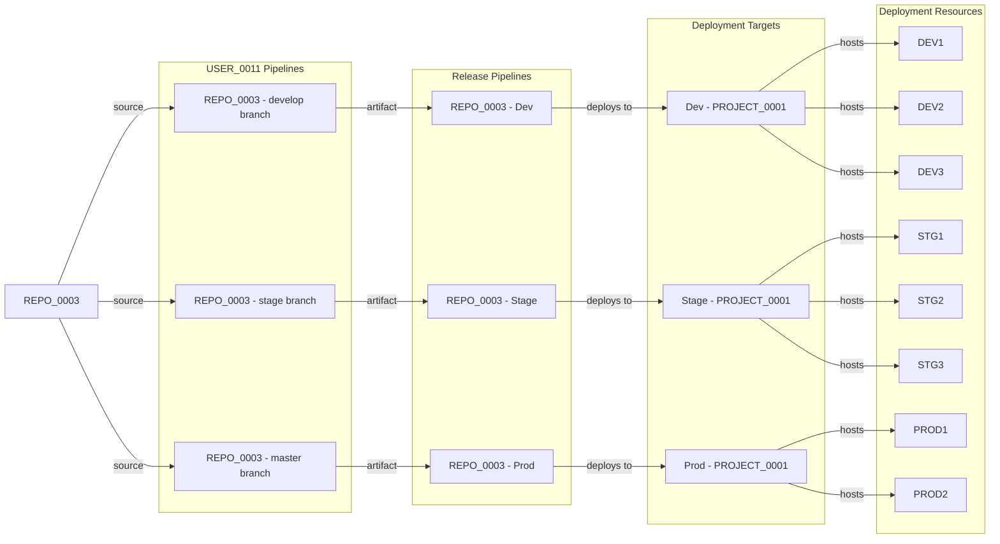
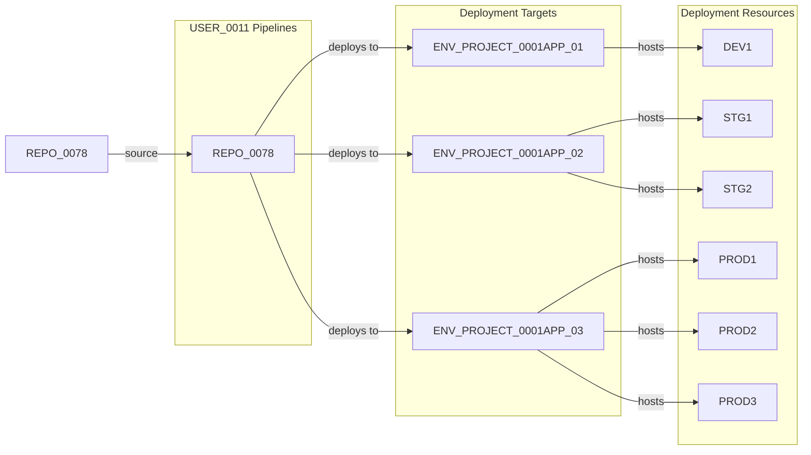

The discovery phase output should create 3 seperate outputs - look like below:
Flatenned CSV:
"Organization","Project","ProjectId","RepositoryName","RepositoryId","DefaultBranch","CloneUrl","SshUrl","WebUrl","Size","IsDisabled","IsPrivate","LastUpdate","PrimaryLanguage","FrameworkType","AllFrameworks","DeployableTypes","HasAPI","HasService","HasFrontend","HasDatabase","TechnologyStack","HasDockerfile","HasPipeline","HasKubernetes","DocumentationPriority","AnalyzedDate"

The JSON and YAML should follow a hirarchial structure

Flatenned CSV is for manual human review, JSON and YAML are for Visualization. I may decide to convert that to a mermaid embedded markdown or use to directly render an astro based UI.


The extraction should follow the folder naming and archival logic as in below script. The extraction logic is for reference only from my other different implementation.

## ADO → GitHub API Surface Map for Discovery

Before the code, the critical field translations:

| ADO PowerShell Concept | GitHub Python Equivalent |
|---|---|
| `$OrganizationUrl` | `--org` (GitHub org name) |
| `GET /projects` (validate auth) | `GET /orgs/{org}` |
| `GET /{project}/_apis/git/repositories` | `GET /orgs/{org}/repos` (Link-header paginated) |
| `repo.remoteUrl` | `repo["clone_url"]` |
| `repo.sshUrl` | `repo["ssh_url"]` |
| `repo.webUrl` | `repo["html_url"]` |
| `repo.defaultBranch` (strip `refs/heads/`) | `repo["default_branch"]` (already clean) |
| `repo.isDisabled` | `repo["archived"]` (closest semantic equivalent) |
| `repo.project.visibility == "private"` | `repo["private"]` |
| `GET /git/repositories/{id}/items?recursionLevel=Full` | `GET /repos/{owner}/{repo}/git/trees/{sha}?recursive=1`  [docs.github](https://docs.github.com/en/rest/git/trees) |
| `repo.size` | `repo["size"]` (same unit: KB) |
| `GET /release/releases` (release count) | `GET /repos/{owner}/{repo}/releases` or `GET /repos/{owner}/{repo}/deployments` |
| `Basic base64(:pat)` auth header | `Bearer {token}` auth header  [docs.github](https://docs.github.com/en/rest/repos/repos) |
| `continuationToken` | `Link: <url>; rel="next"` header  [docs.github](https://docs.github.com/en/rest/git/trees) |

***

## Complete Python Implementation

```python
#!/usr/bin/env python3
"""
github-repo-discovery.py
Discovers all GitHub repositories across an organization.
Equivalent of ado-project-repo-discovery.ps1 — GitHub Edition.

Author: SNK Architecture Team
Version: 1.0
Date: 2026-03-24
"""

import argparse
import asyncio
import csv
import json
import logging
import os
import re
import sys
import time
from datetime import datetime, timezone
from pathlib import Path
from typing import Any

import httpx

# ---------------------------------------------------------------------------
# Constants
# ---------------------------------------------------------------------------

GH_API_BASE = "https://api.github.com"
GH_API_VERSION = "2022-11-28"
RATE_LIMIT_THRESHOLD = 50          # Pre-emptive sleep when remaining < this
MAX_TREE_DEPTH = 3                 # Mirror PS: ($path -split '/').Count -le 4
EXIT_SUCCESS = 0
EXIT_AUTH_FAILURE = 1
EXIT_PARTIAL_FAILURE = 2
EXIT_ALL_FAILED = 3

# ---------------------------------------------------------------------------
# Default exclusion patterns  (mirror $script:DefaultExclusions)
# ---------------------------------------------------------------------------

DEFAULT_EXCLUDE_NAME_PATTERNS: list[str] = [
    r"^[Tt]est",           # Any repo starting with "Test"
    r"[Ss]andbox",         # Any repo containing "Sandbox"
    r"[Pp]ersonal",        # Any repo containing "Personal"
    r"[Dd]emo",            # Any repo containing "Demo"
    r"[Ww]iki",            # Wiki repos
    r"[Aa]rchive",         # Archive repos
    r"^[A-Z]{2,3}-\d+$",  # Temporary pattern like "XYZ-123"
]


# ---------------------------------------------------------------------------
# Logging setup  (dual console + file — mirrors Write-Log)
# ---------------------------------------------------------------------------

def setup_logging(log_path: Path) -> logging.Logger:
    logger = logging.getLogger("gh_discovery")
    logger.setLevel(logging.DEBUG)
    fmt = logging.Formatter("[%(asctime)s] [%(levelname)s] %(message)s",
                            datefmt="%Y-%m-%d %H:%M:%S")
    ch = logging.StreamHandler(sys.stdout)
    ch.setLevel(logging.INFO)
    ch.setFormatter(fmt)
    fh = logging.FileHandler(log_path, encoding="utf-8")
    fh.setLevel(logging.DEBUG)
    fh.setFormatter(fmt)
    logger.addHandler(ch)
    logger.addHandler(fh)
    return logger


# ---------------------------------------------------------------------------
# HTTP client — Link-header pagination + rate-limit inspection
# ---------------------------------------------------------------------------

class GitHubClient:
    """
    Async HTTP client for GitHub REST API.
    Handles:
      - Bearer token auth
      - Link-header pagination (RFC 5988)  — replaces ADO continuationToken
      - Proactive rate-limit inspection     — replaces ADO reactive 429 backoff
      - Secondary rate-limit (403) backoff
    """

    def __init__(
        self,
        token: str,
        max_concurrent: int = 10,
        rate_limit_threshold: int = RATE_LIMIT_THRESHOLD,
        logger: logging.Logger | None = None,
    ) -> None:
        self._token = token
        self._semaphore = asyncio.Semaphore(max_concurrent)
        self._threshold = rate_limit_threshold
        self._log = logger or logging.getLogger("gh_discovery")
        self._client: httpx.AsyncClient | None = None

    async def __aenter__(self) -> "GitHubClient":
        self._client = httpx.AsyncClient(
            base_url=GH_API_BASE,
            headers={
                "Authorization": f"Bearer {self._token}",
                "Accept": "application/vnd.github+json",
                "X-GitHub-Api-Version": GH_API_VERSION,
            },
            timeout=30.0,
        )
        return self

    async def __aexit__(self, *_: object) -> None:
        if self._client:
            await self._client.aclose()

    # ------------------------------------------------------------------
    # Core request with rate-limit handling
    # ------------------------------------------------------------------

    async def _request(
        self, method: str, url: str, **kwargs: Any
    ) -> httpx.Response:
        assert self._client is not None
        for attempt in range(5):
            async with self._semaphore:
                resp = await self._client.request(method, url, **kwargs)

            # Proactive rate-limit inspection (every response)
            await self._check_rate_limit(resp)

            if resp.status_code == 429:
                wait = int(resp.headers.get("retry-after", 60))
                self._log.warning("429 — sleeping %ds (attempt %d)", wait, attempt + 1)
                await asyncio.sleep(wait)
                continue

            if resp.status_code == 403:
                body = resp.text
                # Distinguish scope error (fatal) from secondary rate limit (transient)
                if "rate limit" in body.lower() or "secondary" in body.lower():
                    retry_after = int(resp.headers.get("retry-after", 60))
                    self._log.warning(
                        "Secondary rate limit — sleeping %ds (attempt %d)",
                        retry_after, attempt + 1,
                    )
                    await asyncio.sleep(retry_after)
                    continue
                resp.raise_for_status()   # Real 403 scope error → propagate

            resp.raise_for_status()
            return resp

        raise RuntimeError(f"Exhausted retries for {url}")

    async def _check_rate_limit(self, response: httpx.Response) -> None:
        remaining_str = response.headers.get("x-ratelimit-remaining")
        reset_str = response.headers.get("x-ratelimit-reset")
        if remaining_str is None:
            return
        remaining = int(remaining_str)
        if remaining < self._threshold and reset_str:
            wait = max(0, int(reset_str) - int(time.time())) + 1
            self._log.warning(
                "Rate limit low (%d remaining) — sleeping %ds until reset",
                remaining, wait,
            )
            await asyncio.sleep(wait)

    # ------------------------------------------------------------------
    # Link-header pagination  (replaces ADO continuationToken)
    # ------------------------------------------------------------------

    @staticmethod
    def _next_page_url(response: httpx.Response) -> str | None:
        link = response.headers.get("link", "")
        for part in link.split(","):
            if 'rel="next"' in part:
                return part.split(";")[0].strip().strip("<>")
        return None

    async def get_paginated(self, path: str, params: dict[str, Any] | None = None) -> list[dict[str, Any]]:
        """Collect all pages for a list endpoint."""
        results: list[dict[str, Any]] = []
        url: str | None = path
        while url:
            resp = await self._request("GET", url, params=params)
            data = resp.json()
            # GitHub list endpoints return either a list or {"items": [...]}
            if isinstance(data, list):
                results.extend(data)
            elif isinstance(data, dict) and "items" in data:
                results.extend(data["items"])
            else:
                results.append(data)
            url = self._next_page_url(resp)
            params = None   # URL already contains query params after first page
        return results

    async def get(self, path: str, params: dict[str, Any] | None = None) -> dict[str, Any]:
        resp = await self._request("GET", path, params=params)
        result: dict[str, Any] = resp.json()
        return result

    # ------------------------------------------------------------------
    # Auth validation  (replaces ADO GET /projects?$top=1 probe)
    # ------------------------------------------------------------------

    async def validate_token(self, org: str) -> None:
        try:
            await self.get(f"/orgs/{org}")
        except httpx.HTTPStatusError as exc:
            if exc.response.status_code in (401, 403):
                raise PermissionError(
                    f"Token rejected for org '{org}'. "
                    "Ensure token has scopes: repo, read:org"
                ) from exc
            raise


# ---------------------------------------------------------------------------
# Exclusion logic  (mirrors Get-AllProjects filter block)
# ---------------------------------------------------------------------------

def _compile_patterns(patterns: list[str]) -> list[re.Pattern[str]]:
    return [re.compile(p) for p in patterns]


def _is_excluded(
    repo_name: str,
    extra_names: list[str],
    compiled: list[re.Pattern[str]],
) -> bool:
    if repo_name in extra_names:
        return True
    return any(p.search(repo_name) for p in compiled)


# ---------------------------------------------------------------------------
# Repository file-tree analysis
# (mirrors Analyze-RepositoryLanguage — uses Git Trees API recursive=1)
# Key delta: GET /repos/{owner}/{repo}/git/trees/{sha}?recursive=1
#            replaces ADO GET /git/repositories/{id}/items?recursionLevel=Full
# ---------------------------------------------------------------------------

async def analyze_repository(
    client: GitHubClient,
    owner: str,
    repo: dict[str, Any],
    logger: logging.Logger,
) -> dict[str, Any]:
    """
    Analyze repository file tree for technology stack signals.
    Returns the same analysis shape as the PowerShell Analyze-RepositoryLanguage.
    """
    base = {
        "PrimaryLanguage": "Unknown",
        "FrameworkType": "Unknown",
        "AllFrameworks": [],
        "DeployableTypes": [],
        "TechnologyStack": "Unknown",
        "HasDockerfile": False,
        "HasPipeline": False,
        "HasKubernetes": False,
        "HasAPI": False,
        "HasService": False,
        "HasFrontend": False,
        "HasDatabase": False,
    }

    repo_name = repo["name"]
    default_branch = repo.get("default_branch") or "main"

    try:
        # Resolve branch SHA → tree SHA
        branch_data = await client.get(
            f"/repos/{owner}/{repo_name}/branches/{default_branch}"
        )
        tree_sha = branch_data["commit"]["commit"]["tree"]["sha"]

        # Recursive tree fetch  (replaces ADO recursionLevel=Full)
        tree_data = await client.get(
            f"/repos/{owner}/{repo_name}/git/trees/{tree_sha}",
            params={"recursive": "1"},
        )

        if tree_data.get("truncated"):
            logger.warning(
                "[WARN] Tree truncated for %s/%s — analysis may be incomplete",
                owner, repo_name,
            )

        # Filter to blobs within MAX_TREE_DEPTH levels (mirrors PS depth limit)
        file_paths: list[str] = [
            item["path"]
            for item in tree_data.get("tree", [])
            if item["type"] == "blob"
            and item["path"].count("/") < MAX_TREE_DEPTH
        ]

    except Exception as exc:
        logger.debug("Could not analyze %s: %s", repo_name, exc)
        return base

    a = dict(base)

    # ------------------------------------------------------------------
    # .NET Detection
    # ------------------------------------------------------------------
    dotnet_files = [f for f in file_paths if re.search(r"\.sln$|\.csproj$|\.vbproj$|\.fsproj$|\.cs$|\.vb$|\.fs$", f)]
    if dotnet_files:
        a["PrimaryLanguage"] = ".NET"
        dotnet_frameworks: list[str] = []

        if any(re.search(r"\.API\.|[Cc]ontrollers/|\.Controller\.cs$|Startup\.cs$|Program\.cs", f) for f in file_paths):
            dotnet_frameworks.append(".NET Web API")
            a["HasAPI"] = True
            a["DeployableTypes"].append("API")

        if any(re.search(r"\.Service\.|Worker\.cs$|BackgroundService|\.Worker\.", f) for f in file_paths):
            dotnet_frameworks.append(".NET Service")
            a["HasService"] = True
            a["DeployableTypes"].append("Service")

        if any(re.search(r"Program\.cs$|Startup\.cs$|appsettings\.json$", f) for f in file_paths) and not dotnet_frameworks:
            dotnet_frameworks.append(".NET Application")

        if any(re.search(r"\.exe\.config$|app\.config$|packages\.config$", f) for f in file_paths):
            dotnet_frameworks.append(".NET Framework")

        if not dotnet_frameworks:
            dotnet_frameworks.append(".NET Library")

        a["AllFrameworks"].extend(dotnet_frameworks)
        a["FrameworkType"] = dotnet_frameworks[0]

    # ------------------------------------------------------------------
    # JavaScript / TypeScript Detection
    # ------------------------------------------------------------------
    js_files = [f for f in file_paths if re.search(r"package\.json$|tsconfig\.json$|\.tsx?$|\.jsx?$", f)]
    if js_files:
        if a["PrimaryLanguage"] == "Unknown":
            a["PrimaryLanguage"] = "JavaScript/TypeScript"
        js_frameworks: list[str] = []

        if any(re.search(r"angular\.json$", f) for f in file_paths):
            js_frameworks.append("Angular")
            a["HasFrontend"] = True
            a["DeployableTypes"].append("Frontend")

        if any(re.search(r"next\.config\.|pages/|app/", f) for f in file_paths):
            js_frameworks.append("Next.js")
            a["HasFrontend"] = True
            a["DeployableTypes"].append("Frontend")

        if any(re.search(r"src/.*\.jsx$|src/.*\.tsx$|\.jsx$|\.tsx$", f) for f in file_paths):
            if any(re.search(r"vite\.config\.|vitest\.config\.", f) for f in file_paths):
                js_frameworks.append("React (Vite)")
            else:
                js_frameworks.append("React")
            a["HasFrontend"] = True
            a["DeployableTypes"].append("Frontend")

        if any(re.search(r"vite\.config\.|vitest\.config\.", f) for f in file_paths) and not js_frameworks:
            js_frameworks.append("Vite")
            a["HasFrontend"] = True
            a["DeployableTypes"].append("Frontend")

        if any(re.search(r"server\.js$|app\.js$|index\.js$|express|koa|fastify", f) for f in file_paths):
            js_frameworks.append("Node.js API")
            a["HasAPI"] = True
            a["DeployableTypes"].append("API")
        elif not js_frameworks:
            js_frameworks.append("Node.js")

        a["AllFrameworks"].extend(js_frameworks)
        if a["FrameworkType"] == "Unknown":
            a["FrameworkType"] = js_frameworks[0]

    # ------------------------------------------------------------------
    # Python Detection
    # ------------------------------------------------------------------
    if any(re.search(r"requirements\.txt$|setup\.py$|pyproject\.toml$|\.py$", f) for f in file_paths):
        if a["PrimaryLanguage"] == "Unknown":
            a["PrimaryLanguage"] = "Python"
        a["AllFrameworks"].append("Python Application")
        if a["FrameworkType"] == "Unknown":
            a["FrameworkType"] = "Python Application"

    # ------------------------------------------------------------------
    # SQL / Database Detection
    # ------------------------------------------------------------------
    if any(re.search(r"\.sql$|\.sqlproj$", f) for f in file_paths):
        if a["PrimaryLanguage"] == "Unknown":
            a["PrimaryLanguage"] = "SQL"
        a["AllFrameworks"].append("Database")
        a["HasDatabase"] = True
        a["DeployableTypes"].append("Database")
        if a["FrameworkType"] == "Unknown":
            a["FrameworkType"] = "Database"

    # ------------------------------------------------------------------
    # Infrastructure Detection
    # ------------------------------------------------------------------
    if any(re.search(r"main\.tf$|variables\.tf$|outputs\.tf$|\.bicep$", f) for f in file_paths):
        if a["PrimaryLanguage"] == "Unknown":
            a["PrimaryLanguage"] = "Infrastructure"
        if any(re.search(r"\.tf$", f) for f in file_paths):
            a["AllFrameworks"].append("Terraform")
            if a["FrameworkType"] == "Unknown":
                a["FrameworkType"] = "Terraform"
        elif any(re.search(r"\.bicep$", f) for f in file_paths):
            a["AllFrameworks"].append("Bicep")
            if a["FrameworkType"] == "Unknown":
                a["FrameworkType"] = "Bicep"
        else:
            a["AllFrameworks"].append("Infrastructure as Code")
            if a["FrameworkType"] == "Unknown":
                a["FrameworkType"] = "Infrastructure as Code"

    # ------------------------------------------------------------------
    # Deployment Signal Detection
    # Key delta: GitHub pipeline signal is .github/workflows/ not azure-pipelines.yml
    # ------------------------------------------------------------------
    a["HasDockerfile"] = any(re.search(r"(^|/)Dockerfile$", f) for f in file_paths)
    a["HasPipeline"] = any(re.search(r"\.github/workflows/.*\.ya?ml$", f) for f in file_paths)
    a["HasKubernetes"] = any(re.search(r"k8s/|kubernetes/", f) for f in file_paths)

    stack: list[str] = []
    if a["HasDockerfile"]:
        stack.append("Docker")
    if a["HasPipeline"]:
        stack.append("CI/CD")
    if a["HasKubernetes"]:
        stack.append("Kubernetes")
    a["TechnologyStack"] = ", ".join(stack) if stack else "Traditional"

    return a


# ---------------------------------------------------------------------------
# Release / deployment activity count
# (mirrors Get-RepositoryReleaseCount — uses GitHub releases + deployments)
# Key delta: GitHub exposes /releases AND /deployments natively; no vsrm subdomain
# ---------------------------------------------------------------------------

async def get_release_count(
    client: GitHubClient,
    owner: str,
    repo_name: str,
    logger: logging.Logger,
) -> int:
    try:
        releases = await client.get_paginated(
            f"/repos/{owner}/{repo_name}/releases",
            params={"per_page": 100},
        )
        cutoff = datetime.now(timezone.utc).timestamp() - (90 * 86400)
        recent = [
            r for r in releases
            if r.get("published_at")
            and datetime.fromisoformat(
                r["published_at"].replace("Z", "+00:00")
            ).timestamp() > cutoff
        ]
        return len(recent)
    except Exception as exc:
        logger.debug("Could not get release count for %s: %s", repo_name, exc)
        return 0


# ---------------------------------------------------------------------------
# Documentation priority  (mirrors Get-DocumentationPriority — same 4-tier logic)
# ---------------------------------------------------------------------------

def get_documentation_priority(
    analysis: dict[str, Any],
    release_count: int,
) -> str:
    if release_count > 3:
        return "Tier 1 - Critical"
    if analysis["PrimaryLanguage"] in (".NET", "JavaScript/TypeScript") and analysis["HasPipeline"]:
        return "Tier 2 - Active"
    if analysis["PrimaryLanguage"] != "Unknown":
        return "Tier 3 - Maintenance"
    return "Tier 4 - Unclassified"


# ---------------------------------------------------------------------------
# Core discovery orchestration
# (mirrors Process-AllRepositories)
# ---------------------------------------------------------------------------

async def discover_repositories(
    org: str,
    client: GitHubClient,
    include_archived: bool,
    exclude_names: list[str],
    exclude_patterns: list[str],
    logger: logging.Logger,
) -> list[dict[str, Any]]:

    logger.info("[DISCOVER] Discovering repositories for org: %s", org)

    all_repos: list[dict[str, Any]] = await client.get_paginated(
        f"/orgs/{org}/repos",
        params={"per_page": 100, "type": "all"},
    )

    compiled = _compile_patterns(DEFAULT_EXCLUDE_NAME_PATTERNS + exclude_patterns)

    filtered = [
        r for r in all_repos
        if (include_archived or not r.get("archived", False))
        and not _is_excluded(r["name"], exclude_names, compiled)
    ]

    excluded_count = len(all_repos) - len(filtered)
    logger.info(
        "[REPOS] Found %d repos total, excluded %d, analyzing %d",
        len(all_repos), excluded_count, len(filtered),
    )

    results: list[dict[str, Any]] = []
    total = len(filtered)

    async def process_one(idx: int, repo: dict[str, Any]) -> dict[str, Any]:
        name = repo["name"]
        logger.debug("[%d/%d] Analyzing: %s", idx + 1, total, name)

        analysis = await analyze_repository(client, org, repo, logger)
        release_count = await get_release_count(client, org, name, logger)
        priority = get_documentation_priority(analysis, release_count)

        last_push = repo.get("pushed_at", "")
        last_update = (
            datetime.fromisoformat(last_push.replace("Z", "+00:00")).strftime("%Y-%m-%d")
            if last_push else "Unknown"
        )

        return {
            # Mirror the exact CSV column order from the ADO script output
            "Organization": org,
            "Project": org,                              # GitHub has no "Project" layer; org is the scope unit
            "ProjectId": repo.get("owner", {}).get("id", ""),
            "RepositoryName": name,
            "RepositoryId": str(repo["id"]),
            "DefaultBranch": repo.get("default_branch", ""),
            "CloneUrl": repo.get("clone_url", ""),
            "SshUrl": repo.get("ssh_url", ""),
            "WebUrl": repo.get("html_url", ""),
            "Size": repo.get("size", 0),
            "IsDisabled": repo.get("archived", False),   # archived = closest GitHub equivalent to isDisabled
            "IsPrivate": repo.get("private", True),
            "LastUpdate": last_update,
            "PrimaryLanguage": analysis["PrimaryLanguage"],
            "FrameworkType": analysis["FrameworkType"],
            "AllFrameworks": "; ".join(analysis["AllFrameworks"]),
            "DeployableTypes": "; ".join(analysis["DeployableTypes"]),
            "HasAPI": analysis["HasAPI"],
            "HasService": analysis["HasService"],
            "HasFrontend": analysis["HasFrontend"],
            "HasDatabase": analysis["HasDatabase"],
            "TechnologyStack": analysis["TechnologyStack"],
            "HasDockerfile": analysis["HasDockerfile"],
            "HasPipeline": analysis["HasPipeline"],
            "HasKubernetes": analysis["HasKubernetes"],
            "DocumentationPriority": priority,
            "AnalyzedDate": datetime.now().strftime("%Y-%m-%d %H:%M:%S"),
        }

    tasks = [process_one(i, r) for i, r in enumerate(filtered)]
    batch_results = await asyncio.gather(*tasks, return_exceptions=True)

    for i, result in enumerate(batch_results):
        if isinstance(result, Exception):
            logger.warning("[WARN] Failed repo at index %d: %s", i, result)
        else:
            results.append(result)
            if len(results) % 10 == 0:
                logger.info("[OK] Processed %d repositories...", len(results))

    return results


# ---------------------------------------------------------------------------
# Export  (mirrors Export-Results — CSV + summary .txt)
# ---------------------------------------------------------------------------

CSV_COLUMNS = [
    "Organization", "Project", "ProjectId", "RepositoryName", "RepositoryId",
    "DefaultBranch", "CloneUrl", "SshUrl", "WebUrl", "Size", "IsDisabled",
    "IsPrivate", "LastUpdate", "PrimaryLanguage", "FrameworkType",
    "AllFrameworks", "DeployableTypes", "HasAPI", "HasService", "HasFrontend",
    "HasDatabase", "TechnologyStack", "HasDockerfile", "HasPipeline",
    "HasKubernetes", "DocumentationPriority", "AnalyzedDate",
]


def export_csv(repos: list[dict[str, Any]], output_path: Path) -> None:
    with output_path.open("w", newline="", encoding="utf-8-sig") as f:  # BOM for Excel
        writer = csv.DictWriter(f, fieldnames=CSV_COLUMNS, quoting=csv.QUOTE_ALL)
        writer.writeheader()
        writer.writerows(repos)


def export_summary(repos: list[dict[str, Any]], summary_path: Path, org: str) -> None:
    def count(pred: Any) -> int:
        return sum(1 for r in repos if pred(r))

    def group_by(key: str) -> str:
        from collections import Counter
        counts = Counter(r[key] for r in repos)
        return "\n".join(f"  {k}: {v}" for k, v in sorted(counts.items(), key=lambda x: -x [docs.github](https://docs.github.com/en/rest/git/trees)))

    lines = [
        "SNK Repository Discovery Summary (GitHub Edition)",
        f"Generated: {datetime.now()}",
        f"Organization: {org}",
        "",
        "OVERVIEW:",
        "=========",
        f"Total Repositories:    {len(repos)}",
        f"Active Repositories:   {count(lambda r: not r['IsDisabled'])}",
        f"Archived Repositories: {count(lambda r: r['IsDisabled'])}",
        "",
        "BY LANGUAGE:",
        "============",
        group_by("PrimaryLanguage"),
        "",
        "BY FRAMEWORK:",
        "=============",
        group_by("FrameworkType"),
        "",
        "BY DOCUMENTATION PRIORITY:",
        "==========================",
        group_by("DocumentationPriority"),
        "",
        "MULTI-FRAMEWORK ANALYSIS:",
        "=========================",
        f"With Multiple Frameworks: {count(lambda r: ';' in r['AllFrameworks'])}",
        f"With API Components:      {count(lambda r: r['HasAPI'])}",
        f"With Service Components:  {count(lambda r: r['HasService'])}",
        f"With Frontend Components: {count(lambda r: r['HasFrontend'])}",
        f"With Database Components: {count(lambda r: r['HasDatabase'])}",
        "",
        "DEPLOYMENT PATTERNS:",
        "====================",
        f"With Dockerfile:   {count(lambda r: r['HasDockerfile'])}",
        f"With CI/CD Pipeline (Actions): {count(lambda r: r['HasPipeline'])}",
        f"With Kubernetes:   {count(lambda r: r['HasKubernetes'])}",
        "",
        "RECOMMENDATIONS:",
        "================",
        f"1. Start with Tier 1 repos ({count(lambda r: r['DocumentationPriority'] == 'Tier 1 - Critical')} repos)",
        f"2. Focus on .NET projects ({count(lambda r: r['PrimaryLanguage'] == '.NET')} repos)",
        f"3. Review multi-framework repos ({count(lambda r: ';' in r['AllFrameworks'])} repos)",
        f"4. Review Tier 4 unclassified ({count(lambda r: r['DocumentationPriority'] == 'Tier 4 - Unclassified')} repos)",
        f"5. Modernize repos without CI/CD ({count(lambda r: not r['HasPipeline'])} repos)",
    ]
    summary_path.write_text("\n".join(lines), encoding="utf-8")


def show_quick_stats(repos: list[dict[str, Any]], logger: logging.Logger) -> None:
    def count(pred: Any) -> int:
        return sum(1 for r in repos if pred(r))

    logger.info("[STATS] ========================")
    logger.info("[STATS] Total Repositories:        %d", len(repos))
    logger.info("[STATS] .NET:                       %d", count(lambda r: r["PrimaryLanguage"] == ".NET"))
    logger.info("[STATS] JavaScript/TypeScript:      %d", count(lambda r: r["PrimaryLanguage"] == "JavaScript/TypeScript"))
    logger.info("[STATS] Tier 1 (Critical):          %d", count(lambda r: r["DocumentationPriority"] == "Tier 1 - Critical"))
    logger.info("[STATS] With CI/CD (Actions):       %d", count(lambda r: r["HasPipeline"]))
    logger.info("[STATS] With Docker:                %d", count(lambda r: r["HasDockerfile"]))
    logger.info("[STATS] ========================")


# ---------------------------------------------------------------------------
# Exclusion template generator  (mirrors Initialize-ExclusionConfiguration)
# ---------------------------------------------------------------------------

def generate_exclusion_template(path: Path) -> None:
    content = """\
# SNK Repository Discovery - Repo Exclusion Configuration
# Edit this file and pass patterns via --exclude-repo-patterns
#
# Patterns are Python regex strings matched against repository name.
# Examples:
#   Test.*          # repos starting with "Test"
#   .*-Archive$     # repos ending with "-Archive"
#   .*[Ss]andbox.*  # repos containing "Sandbox"
#
# Your custom exclusions:
# MyOldRepo
# ^INFRA-\\d+$
"""
    path.write_text(content, encoding="utf-8")
    print(f"[TEMPLATE] Generated exclusion template: {path}")


# ---------------------------------------------------------------------------
# CLI entry point  (mirrors param() block)
# ---------------------------------------------------------------------------

def build_parser() -> argparse.ArgumentParser:
    p = argparse.ArgumentParser(
        description="SNK GitHub Repository Discovery — GitHub Edition of ado-project-repo-discovery.ps1"
    )
    p.add_argument("--org", required=True, help="GitHub organization name")
    p.add_argument("--token", default=None,
                   help="GitHub PAT. Falls back to $GH_TOKEN / $GITHUB_TOKEN env vars.")
    p.add_argument("--output-path", default="",
                   help="CSV output path. Auto-generated with timestamp if omitted.")
    p.add_argument("--log-path", default="",
                   help="Log file path. Auto-generated with timestamp if omitted.")
    p.add_argument("--include-archived", action="store_true", default=False,
                   help="Include archived repos (equivalent to -IncludeInactive in PS).")
    p.add_argument("--max-concurrent", type=int, default=10,
                   help="Max concurrent HTTP requests (default: 10).")
    p.add_argument("--exclude-repo-names", nargs="*", default=[],
                   help="Exact repo names to exclude.")
    p.add_argument("--exclude-repo-patterns", nargs="*", default=[],
                   help="Regex patterns for repo names to exclude.")
    p.add_argument("--generate-exclusion-template", action="store_true",
                   help="Write exclusion pattern template and exit.")
    p.add_argument("--dry-run", action="store_true",
                   help="Validate token and print planned API calls. No data written.")
    return p


async def main() -> int:
    parser = build_parser()
    args = parser.parse_args()

    # ------------------------------------------------------------------
    # Exclusion template shortcut
    # ------------------------------------------------------------------
    if args.generate_exclusion_template:
        generate_exclusion_template(Path("excluded-repos-template.txt"))
        return EXIT_SUCCESS

    # ------------------------------------------------------------------
    # Timestamped output paths  (mirrors $timestamp logic)
    # ------------------------------------------------------------------
    timestamp = datetime.now().strftime("%Y-%m-%d_%H-%M-%S")
    results_folder = Path("discovery-results")
    logs_folder = Path("discovery-logs")
    results_folder.mkdir(exist_ok=True)
    logs_folder.mkdir(exist_ok=True)

    output_path = Path(args.output_path) if args.output_path else \
        results_folder / f"code-repositories_{timestamp}.csv"
    log_path = Path(args.log_path) if args.log_path else \
        logs_folder / f"repository-discovery_{timestamp}.log"

    logger = setup_logging(log_path)
    logger.info("[START] SNK GitHub Repository Discovery Tool")
    logger.info("[START] =====================================")
    logger.info("[START] Log file: %s", log_path)

    # ------------------------------------------------------------------
    # Token resolution  (mirrors PAT fallback chain)
    # Primary: --token | $GH_TOKEN | $GITHUB_TOKEN
    # ------------------------------------------------------------------
    token = (
        args.token
        or os.environ.get("GH_TOKEN")
        or os.environ.get("GITHUB_TOKEN")
    )
    if not token:
        logger.error(
            "[AUTH] No token found. Set GH_TOKEN / GITHUB_TOKEN env var or use --token."
        )
        return EXIT_AUTH_FAILURE

    # ------------------------------------------------------------------
    # Dry-run mode
    # ------------------------------------------------------------------
    if args.dry_run:
        logger.info("[DRY-RUN] Would execute:")
        logger.info("  GET /orgs/%s  (auth validation)", args.org)
        logger.info("  GET /orgs/%s/repos  (paginated)", args.org)
        logger.info("  Per repo: GET /repos/%s/{name}/branches/{branch}", args.org)
        logger.info("  Per repo: GET /repos/%s/{name}/git/trees/{sha}?recursive=1", args.org)
        logger.info("  Per repo: GET /repos/%s/{name}/releases", args.org)
        logger.info("[DRY-RUN] No data written. Exit 0.")
        return EXIT_SUCCESS

    # ------------------------------------------------------------------
    # Auth validation + discovery
    # ------------------------------------------------------------------
    try:
        async with GitHubClient(
            token=token,
            max_concurrent=args.max_concurrent,
            logger=logger,
        ) as client:
            try:
                await client.validate_token(args.org)
                logger.info("[AUTH] Token validated for org: %s", args.org)
            except PermissionError as exc:
                logger.error("[AUTH] %s", exc)
                return EXIT_AUTH_FAILURE

            repos = await discover_repositories(
                org=args.org,
                client=client,
                include_archived=args.include_archived,
                exclude_names=args.exclude_repo_names,
                exclude_patterns=args.exclude_repo_patterns,
                logger=logger,
            )

        if not repos:
            logger.error("[ERROR] No repositories discovered. Check permissions.")
            return EXIT_ALL_FAILED

        show_quick_stats(repos, logger)

        export_csv(repos, output_path)
        logger.info("[OK] CSV export: %s", output_path)

        summary_path = output_path.with_suffix("").with_name(
            output_path.stem + "-summary.txt"
        )
        export_summary(repos, summary_path, args.org)
        logger.info("[OK] Summary export: %s", summary_path)

        logger.info("[SUCCESS] Discovery completed!")
        logger.info("Next Steps:")
        logger.info("  1. Review CSV: %s", output_path)
        logger.info("  2. Check logs: %s", log_path)
        logger.info("  3. Start with Tier 1 repositories for documentation")

        return EXIT_SUCCESS

    except Exception as exc:
        logger.error("[ERROR] %s", exc, exc_info=True)
        return EXIT_ALL_FAILED


if __name__ == "__main__":
    sys.exit(asyncio.run(main()))
```

***

## Spec Delta Register

Every behavioral difference from the ADO PowerShell script is a **Spec decision**, not an implementation accident:

| Concern | ADO PowerShell | GitHub Python | Rationale |
|---|---|---|---|
| **Auth header** | `Basic base64(:pat)` | `Bearer {token}` | GitHub token format  [docs.github](https://docs.github.com/en/rest/repos/repos) |
| **Auth validation call** | `GET /_apis/projects?$top=1` | `GET /orgs/{org}` | Org endpoint confirms org-scope token |
| **Auth env var** | `$AZURE_DEVOPS_PAT` | `$GH_TOKEN` / `$GITHUB_TOKEN` | GitHub convention; both checked for backward compat |
| **Pagination** | `continuationToken` body field | `Link: rel="next"` header | RFC 5988 — GitHub standard  [docs.github](https://docs.github.com/en/rest/git/trees) |
| **Rate limit** | Reactive 429 backoff | Proactive `X-RateLimit-Remaining` inspection | GitHub's primary signal; 429 is secondary |
| **403 handling** | Single: insufficient scope | Dual: scope error OR secondary rate limit | Body message discriminates the two cases |
| **Project layer** | ADO has org → project → repo | GitHub has org → repo (no project layer) | `Project` column maps to `org` as the scope unit |
| **isDisabled** | `repo.isDisabled` (ADO soft-disable) | `repo.archived` (closest semantic match) | GitHub has no "disabled" state; archived is the equivalent |
| **File tree API** | `GET /items?recursionLevel=Full` | `GET /git/trees/{sha}?recursive=1` | GitHub Git Trees API  [docs.github](https://docs.github.com/en/rest/git/trees); checks `truncated` flag |
| **Pipeline detection** | `azure-pipelines.yml` pattern | `.github/workflows/*.yml` pattern | GitHub Actions workflow path |
| **Release count** | Queries Release API (`vsrm`) | `GET /repos/{owner}/{repo}/releases` | Native GitHub releases endpoint; no subdomain split |
| **Concurrency** | PowerShell jobs (implicit) | `asyncio.gather` + `Semaphore(10)` | Explicit async-first design |
| **CSV BOM** | `Export-Csv -Encoding UTF8` (no BOM) | `utf-8-sig` (with BOM) | Excel compatibility — same intent as ADO script |


#The pipeline visualization

here is the output sample from my ADO based implementattion.
Deployment chain:
{
  "count": 123,
  "items": [
    {
      "repoId": "fjghjjk",
      "repoName": "REPO_0001",
      "USER_0011PipelineId": 1245,
      "USER_0011PipelineName": "REPO_0001 - Dev",
      "releasePipelineId": 71,
      "releasePipelineName": "REPO_0001 - Dev",
      "releaseStages": [
        "Dev REPO_0001"
      ],
      "deploymentTargetId": 123,
      "deploymentTargetType": "deploymentGroup",
      "deploymentTargetName": "Dev - PROJECT_0001 Web",
      "linkageMethod": "release-deploy-phase",
      "iisConfig": null,
      "k8sContext": null,
      "resourceNames": []
    }  ]
}

deployment topology CSV
"RepoName","USER_0011PipelineName","ReleasePipelineName","DeploymentTarget","DeploymentResource"
"REPO_0001","REPO_0001 - Dev","REPO_0001 - Dev","Dev - PROJECT_0001 Web","DC1-DEV-111"
"REPO_0001","REPO_0001 - Dev","REPO_0001 - Dev","Dev - PROJECT_0001 Web","DC1-DEV-222"
"REPO_0001","REPO_0001 - Dev","REPO_0001 - Dev","Dev - PROJECT_0001 Web","DC1-DEV-100"
"REPO_0001","REPO_0001 - Stage","REPO_0001 - Stage","Stage - PROJECT_0001 Web","DC1-STG-111"
"REPO_0001","REPO_0001 - Stage","REPO_0001 - Stage","Stage - PROJECT_0001 Web","DC1-STG-222"
"REPO_0001","REPO_0001 - Stage","REPO_0001 - Stage","Stage - PROJECT_0001 Web","DC1-STG-333"
"REPO_0001","REPO_0001 - Prod","REPO_0001 - Prod","REPO_0001 - Prod","DC1-PROD-111"
"REPO_0001","REPO_0001 - Prod","REPO_0001 - Prod","REPO_0001 - Prod","DC1-PROD-222"
"REPO_0001","REPO_0001 - UAT","REPO_0001 - UAT","REPO_0001 - UAT","DC1-UAT-111"
"REPO_0001","REPO_0001 - UAT","REPO_0001 - UAT","REPO_0001 - UAT","DC1-UAT-222"

Deployment Topology Markdown:
# Deployment Topology


## REPO_0003


*3 pipeline chains*





## REPO_0078


*1 pipeline chain*




