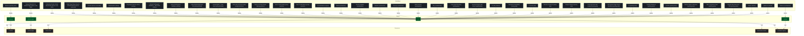

# Pipeline Architecture Report

## Dependencies Map

```mermaid
flowchart TD
    %% title: Aggregate Pipeline Dependencies Map
  classDef atlasRoot fill:#004882,stroke:#a3c9ff,stroke-width:2px,color:#d3e4ff
  classDef atlasCategory fill:#212428,stroke:#E87A48,stroke-width:1.5px,color:#dfe3eb
  classDef atlasWorkflow fill:#1b2026,stroke:#a3c9ff,stroke-width:1.5px,color:#dfe3eb
  classDef atlasJob fill:#171c22,stroke:#8d9199,stroke-width:1px,color:#dfe3eb
  classDef atlasTarget fill:#005227,stroke:#8bd99b,stroke-width:1.5px,color:#a7f6b6
  classDef atlasAlert fill:#93000a,stroke:#ffb4ab,stroke-width:1.5px,color:#ffdad6
  classDef atlasMore fill:#252a31,stroke:#8d9199,stroke-dasharray:4 4,color:#c3c6cf
    subgraph Workflows
        direction TB
        wf_atruss_code_atlas_Scheduled_Public_GitHub_Benchmark["Scheduled Public GitHub Benchmark (atruss-code-atlas)"]:::atlasWorkflow
        wf_atruss_code_atlas_Daily_Target_Repo_Exports___Portal_Refresh["Daily Target Repo Exports & Portal Refresh (atruss-code-atlas)"]:::atlasWorkflow
        wf_atruss_code_atlas_Deploy_Material_UI_to_GitHub_Pages["Deploy Material UI to GitHub Pages (atruss-code-atlas)"]:::atlasWorkflow
        wf_atruss_code_atlas_CI_Suite["CI Suite (atruss-code-atlas)"]:::atlasWorkflow
        wf_eShop_Markdownlint["Markdownlint (eShop)"]:::atlasWorkflow
        wf_eShop_Playwright_Tests_for_eShop["Playwright Tests for eShop (eShop)"]:::atlasWorkflow
        wf_eShop_eShop_Pull_Request_Validation____NET_MAUI["eShop Pull Request Validation - .NET MAUI (eShop)"]:::atlasWorkflow
        wf_eShop_eShop_Pull_Request_Validation["eShop Pull Request Validation (eShop)"]:::atlasWorkflow
        wf_eShopOnWeb_eShopOnWeb_Build_and_Test["eShopOnWeb Build and Test (eShopOnWeb)"]:::atlasWorkflow
        wf_eShopOnWeb_eShopOnWeb___Code_Index["eShopOnWeb - Code Index (eShopOnWeb)"]:::atlasWorkflow
        wf_todo_nodejs_mongo_terraform_azure_dev_yml["azure-dev.yml (todo-nodejs-mongo-terraform)"]:::atlasWorkflow
        wf_spring_petclinic_Deploy_and_Test_Cluster["Deploy and Test Cluster (spring-petclinic)"]:::atlasWorkflow
        wf_spring_petclinic_Java_CI_with_Gradle["Java CI with Gradle (spring-petclinic)"]:::atlasWorkflow
        wf_spring_petclinic_Java_CI_with_Maven["Java CI with Maven (spring-petclinic)"]:::atlasWorkflow
        wf_notifications_engine_CI["CI (notifications-engine)"]:::atlasWorkflow
        wf_vaultwarden_Build["Build (vaultwarden)"]:::atlasWorkflow
        wf_vaultwarden_Check_templates["Check templates (vaultwarden)"]:::atlasWorkflow
        wf_vaultwarden_Hadolint["Hadolint (vaultwarden)"]:::atlasWorkflow
        wf_vaultwarden_Release["Release (vaultwarden)"]:::atlasWorkflow
        wf_vaultwarden_Cleanup["Cleanup (vaultwarden)"]:::atlasWorkflow
        wf_vaultwarden_SDK_live_tests["SDK live tests (vaultwarden)"]:::atlasWorkflow
        wf_vaultwarden_Trivy["Trivy (vaultwarden)"]:::atlasWorkflow
        wf_vaultwarden_Code_Spell_Checking["Code Spell Checking (vaultwarden)"]:::atlasWorkflow
        wf_vaultwarden_Security_Analysis_with_zizmor["Security Analysis with zizmor (vaultwarden)"]:::atlasWorkflow
        wf_rails_failover_CI["CI (rails_failover)"]:::atlasWorkflow
        wf_sentry_php_Backward_compatibility["Backward compatibility (sentry-php)"]:::atlasWorkflow
        wf_sentry_php_CI["CI (sentry-php)"]:::atlasWorkflow
        wf_sentry_php_Decision_model_lint["Decision model lint (sentry-php)"]:::atlasWorkflow
        wf_sentry_php_Prepare_Release["Prepare Release (sentry-php)"]:::atlasWorkflow
        wf_sentry_php_Code_style_and_static_analysis["Code style and static analysis (sentry-php)"]:::atlasWorkflow
        wf_posthog_elixir_Call_Feature_Flags_Project_Workflow["Call Feature Flags Project Workflow (posthog-elixir)"]:::atlasWorkflow
        wf_posthog_elixir_CI["CI (posthog-elixir)"]:::atlasWorkflow
        wf_posthog_elixir_CodeQL_Advanced["CodeQL Advanced (posthog-elixir)"]:::atlasWorkflow
        wf_posthog_elixir_Lint_PR["Lint PR (posthog-elixir)"]:::atlasWorkflow
        wf_posthog_elixir_Release_failure_notification["Release failure notification (posthog-elixir)"]:::atlasWorkflow
        wf_posthog_elixir_Release["Release (posthog-elixir)"]:::atlasWorkflow
        wf_posthog_elixir_SDK_Compliance_Tests["SDK Compliance Tests (posthog-elixir)"]:::atlasWorkflow
        wf_posthog_elixir_Handle_stale_issues_and_PRs["Handle stale issues and PRs (posthog-elixir)"]:::atlasWorkflow
        wf_docker_Images["Images (docker)"]:::atlasWorkflow
        wf_docker_update_sh["update.sh (docker)"]:::atlasWorkflow
    end
    subgraph Targets
        direction TB
        tgt_ci["ci"]:::atlasTarget
        tgt_github_pages["github-pages"]:::atlasTarget
        tgt_release["release"]:::atlasTarget
        tgt_Release["Release"]:::atlasTarget
    end
    subgraph Resources
        direction TB
        res_ci_runner["ci-runner"]:::atlasCategory
        res_github_pages["github-pages"]:::atlasCategory
        res_azure_cloud["azure-cloud"]:::atlasCategory
        res_kubernetes_cluster["kubernetes-cluster"]:::atlasCategory
        res_container_registry["container-registry"]:::atlasCategory
    end

    wf_atruss_code_atlas_Scheduled_Public_GitHub_Benchmark -->|deploy| tgt_ci
    tgt_ci -->|host| res_ci_runner
    wf_atruss_code_atlas_Daily_Target_Repo_Exports___Portal_Refresh -->|deploy| tgt_ci
    wf_atruss_code_atlas_Deploy_Material_UI_to_GitHub_Pages -->|deploy| tgt_github_pages
    tgt_github_pages -->|host| res_github_pages
    wf_atruss_code_atlas_CI_Suite -->|deploy| tgt_ci
    wf_eShop_Markdownlint -->|deploy| tgt_ci
    wf_eShop_Playwright_Tests_for_eShop -->|deploy| tgt_ci
    wf_eShop_eShop_Pull_Request_Validation____NET_MAUI -->|deploy| tgt_ci
    wf_eShop_eShop_Pull_Request_Validation -->|deploy| tgt_ci
    wf_eShopOnWeb_eShopOnWeb_Build_and_Test -->|deploy| tgt_ci
    wf_eShopOnWeb_eShopOnWeb___Code_Index -->|deploy| tgt_ci
    wf_todo_nodejs_mongo_terraform_azure_dev_yml -->|deploy| tgt_ci
    tgt_ci -->|host| res_azure_cloud
    wf_spring_petclinic_Deploy_and_Test_Cluster -->|deploy| tgt_ci
    tgt_ci -->|host| res_kubernetes_cluster
    wf_spring_petclinic_Java_CI_with_Gradle -->|deploy| tgt_ci
    wf_spring_petclinic_Java_CI_with_Maven -->|deploy| tgt_ci
    wf_notifications_engine_CI -->|deploy| tgt_ci
    wf_vaultwarden_Build -->|deploy| tgt_ci
    wf_vaultwarden_Check_templates -->|deploy| tgt_ci
    wf_vaultwarden_Hadolint -->|deploy| tgt_ci
    tgt_ci -->|host| res_container_registry
    wf_vaultwarden_Release -->|deploy| tgt_release
    tgt_release -->|host| res_container_registry
    wf_vaultwarden_Cleanup -->|deploy| tgt_ci
    wf_vaultwarden_SDK_live_tests -->|deploy| tgt_ci
    wf_vaultwarden_Trivy -->|deploy| tgt_ci
    wf_vaultwarden_Code_Spell_Checking -->|deploy| tgt_ci
    wf_vaultwarden_Security_Analysis_with_zizmor -->|deploy| tgt_ci
    wf_rails_failover_CI -->|deploy| tgt_ci
    wf_sentry_php_Backward_compatibility -->|deploy| tgt_ci
    wf_sentry_php_CI -->|deploy| tgt_ci
    wf_sentry_php_Decision_model_lint -->|deploy| tgt_ci
    wf_sentry_php_Prepare_Release -->|deploy| tgt_ci
    wf_sentry_php_Code_style_and_static_analysis -->|deploy| tgt_ci
    wf_posthog_elixir_Call_Feature_Flags_Project_Workflow -->|deploy| tgt_ci
    wf_posthog_elixir_CI -->|deploy| tgt_ci
    wf_posthog_elixir_CodeQL_Advanced -->|deploy| tgt_ci
    wf_posthog_elixir_Lint_PR -->|deploy| tgt_ci
    wf_posthog_elixir_Release_failure_notification -->|deploy| tgt_ci
    wf_posthog_elixir_Release -->|deploy| tgt_Release
    tgt_Release -->|host| res_ci_runner
    wf_posthog_elixir_SDK_Compliance_Tests -->|deploy| tgt_ci
    wf_posthog_elixir_Handle_stale_issues_and_PRs -->|deploy| tgt_ci
    wf_docker_Images -->|deploy| tgt_ci
    wf_docker_update_sh -->|deploy| tgt_ci
```
